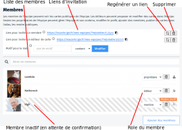

- equipe
- inviter
- ajouter
- membre

Une équipe est constituée de membres qui peuvent voir ou modifier (lorsqu'ils sont rédacteurs) les cartes au sein de l'équipe.

Vous pouvez facilement ajouter des membres sur la [page de profil de votre équipe](https://macarte.ign.fr/mes-equipes/#profil)

Pour ajouter un nouveau membre, vous pouvez soit leur envoyer un lien d'invitation, soit utiliser le bouton <button>Ajouter des membres</button> sous la liste des membres.

### Ajouter un membre

Dans le second cas, un dialogue vous propose de **rechercher un membre** dans la liste des utilisateurs de Ma carte pour l'inviter à participer à votre équipe. Vous devez connaître son nom public.

> 📧 Un mail est envoyé aux personnes lorsque vous les invitez dans une équipe ou lorsque vous changez leur rôle pour les avertir.

Tant que la personne n'aura pas validé l'invitation, le membre restera inactif dans la liste et il ne pourra pas participer.

Vous retrouverez sur la [page de gestion](https://macarte.ign.fr/mes-equipes/) de votre équipe la liste des invitations que vous avez reçues, en attente de validation.

### Envoyer un lien d'invitation

Vous pouvez également envoyer un **lien d'invitation** à la personne que vous voulez intégrer dans votre équipe. Si cette personne n'a pas de compte sur Ma carte, il devra en créer un avant de cliquer sur le lien.

Il existe deux liens d'invitation suivant que vous voulez inviter un simple membre ou un éditeur qui pourra modifier les cartes de l'équipe.
Il n'est pas possible d'ajouter directement un propriétaire à l'équipe via une invitation. Pour cela vous devrez modifier son rôle a posteriori.

Vous pouvez également ajouter un **motif de mail** afin de restreindre la portée du lien. Ainsi, en ajoutant un motif qui finit par `@organisme.fr`, vous vous assurez que quelqu'un qui recevrait le lien d'invitation et qui n'aurait pas un mail de votre organisme ne pourrait pas l'utiliser.

Vous pouvez à tout moment supprimer le lien d'invitation ou en générer un nouveau, lorsque votre campagne d'inscription se termine.

> 💡 Pensez à remplir le profil de votre équipe avant d'inviter de nouveaux membres afin de bien expliquer le but de l'équipe et ce que vous en attendez. 

1. [Comment travailler en équipe ?](./Comment_travailler_en_équipe.md)
1. [Quels sont les rôles au sein d'une équipe ?](./Quels_sont_les_roles_au_sein_d'une_équipe.md)
1. [Qui peut voir les cartes d'une équipe ?](./Qui_peut_voir_les_cartes_d'une_équipe.md)
1. [Comment travailler à plusieurs sur une carte ?](./Comment_travailler_à_plusieurs_sur_une_carte.md)
