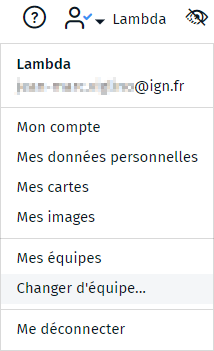

- equipe
- équipe
- partager
- plusieurs
- collaborer
- travailler

Les équipes sont des espaces partagés dans lesquels vous pouvez collaborer et partager des cartes avec d'autres utilisateurs de Ma carte (les membres de l'équipe).
Vous pouvez créer autant d'équipes que vous voulez, pour cela, [rendez-vous sur l'espace dédié](https://macarte.ign.fr/mes-equipes/) dans le menu utilisateur.

Les cartes publiées dans une équipe ne sont visibles que par les autres membres de l'équipe et seuls [les éditeurs](#./Quels_sont_les_roles_au_sein_d'une_équipe.md) peuvent rédiger des cartes dans l'équipe.
Vous pouvez également choisir de publier une carte dans l'atlas et, dans ce cas, elle sera visible par tous.

Vous pouvez [ajouter des membres](#./Comment_inviter_des_membres_dans_une_équipe.md) à vos équipes et leur donner [des rôles spécifiques](#./Quels_sont_les_roles_au_sein_d'une_équipe.md).

Les équipes ont des pages dédiées visibles sur le site de Ma carte et sur lesquelles sont listées les cartes publiées dans l'atlas (atlas de l'équipe).
Vous pouvez également retrouver la liste des équipes auxquelles vous participez sur [la page dédiée de votre espace personnel](https://macarte.ign.fr/mes-equipes/).
Pour chaque équipe vous pouvez consulter les cartes publiques de l'équipe et, si vous êtes éditeur de l'équipe, la liste de cartes auxquelles vous avez accès. En tant que propriétaire d'une équipe, vous avez également aux fonctionnalités d'administration.

Vous pouvez changer d'équipe à tout moment dans le menu utilisateur. Cependant, ce faisant, vous perdrez les données en cours d'édition dans une autre équipe.

Lorsque vous êtes connecté sur une équipe le nom et le logo de l'équipe viennent s'afficher dans la ligne de titre.

1. [Comment inviter des membres dans une équipe](./Comment_inviter_des_membres_dans_une_équipe.md)
1. [Quels sont les rôles au sein d'une équipe ?](./Quels_sont_les_roles_au_sein_d'une_équipe.md)
1. [Qui peut voir les cartes d'une équipe ?](./Qui_peut_voir_les_cartes_d'une_équipe.md)
1. [Comment travailler à plusieurs sur une carte ?](./Comment_travailler_à_plusieurs_sur_une_carte.md)
1. [Travailler à plusieurs sur une carte](./Comment_travailler_à_plusieurs_sur_une_carte.md)