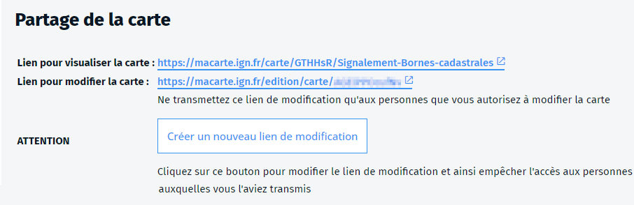

- travail
- travailler
- plusieurs
- collaboratif
- collaborer
- éditer
- carte

Lorsque vous avez créé une carte, vous pouvez partager un **lien en édition** avec d'autres utilisateurs de Ma carte.
Vous retrouverez ce lien sur la page de la [carte sur votre compte](https://macarte.ign.fr/mon-compte/#cartes) en cliquant sur le bouton `Détail` de la carte.

Toute personne ayant ce lien peut accéder à la carte et la modifier. Ce peut être utile si vous voulez travailler à plusieurs sur la carte.

⚠️ Il n'y a pas de contrôle sur qui modifie la carte. Si deux personnes modifient la carte en même temps, ce sont les modifications de la dernière qui enregistre qui seront prises en compte.
⚠️ Faites attention à qui vous communiquez l'adresse de modification.
Vous pouvez à tout moment `Créer un nouveau lien de modification` en cliquant sur le bouton sur la page de la carte. Dans ce cas, l'ancien ne sera plus actif.

### Travailler en équipe

Vous pouvez aussi [créer des équipes](#../equipe/Comment_travailler_en_équipe.md) pour segmenter le partage de vos cartes et avoir un meilleur contrôle sur la manière d'éditer une carte.
Dans ce cas, les cartes carte publiques ne sont visibles que par [les membres de l'équipe](#./Quels_sont_les_roles_au_sein_d'une_équipe.md) et seuls les éditeurs peuvent modifier une carte.

1. [Comment partager une carte](../macarte/Comment_partager_une_carte.md)
1. [Comment travailler en équipe ?](../equipe/Comment_travailler_en_équipe.md)
1. [Qui peut voir mes cartes ?](../equipe/Qui_peut_voir_mes_cartes.md)