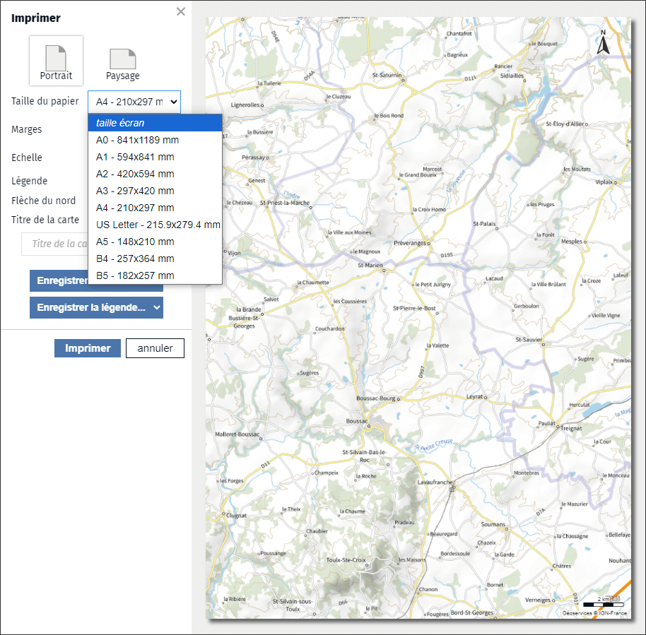

- imprimer
- impression
- image
- exporter
- carte
- document
- JPG
- PNG
- PDF

Vous pouvez à tout moment imprimer une carte via l'outil d'impression <i class="fi-print"></i> dans l'outil d'édition.
Vous pouvez également ajouter cet outil dans votre narration pour permettre à vos lecteurs d'imprimer la carte.

Vous pouvez imprimer la carte sur une imprimante, dans ce cas, vérifiez que les paramètres de l'imprimante correspondent bien à ceux spécifiés lors de la configuration de l'impression (taille du papier, orientation).
Vous pouvez également enregistrer une image de la carte au format PDF ou dans un fichier image (format JPG ou PNG) pour l'inclure dans un document.

1. [Pourquoi ma carte ne s'imprime pas ?](./Problème_pourquoi_ma_carte_ne_s'imprime_pas.md)
1. [Comment partager une carte ?](./Comment_partager_une_carte.md)
