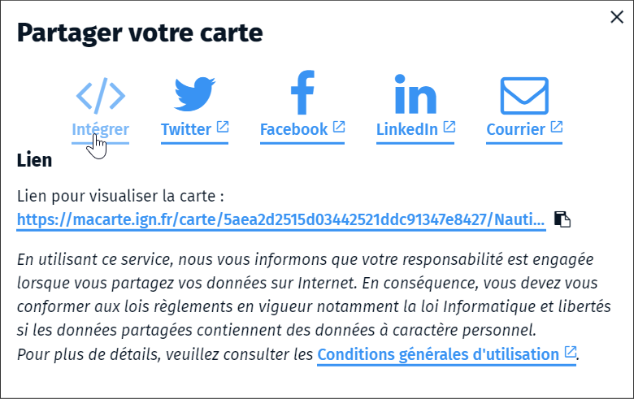
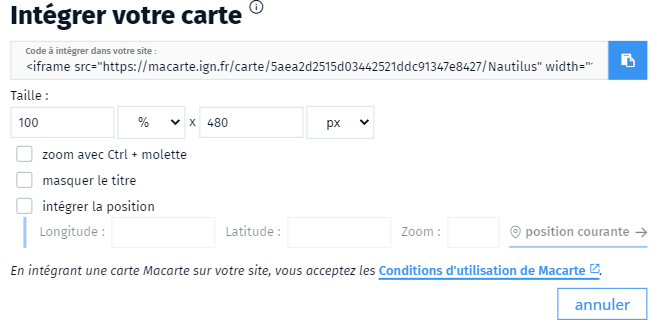

- iframe
- intégrer
- macarte
- partage
- widget carte

Vous pouvez intégrer facilement votre carte sur votre site sous forme d'une iFrame.
Les outils d'édition propose une interface pour formater l'affichage du widget dans le menu de partage <i class="fi-share-alt"></i> puis en choisissant l'option `intégrer`.

Il est possible de dimensionner la fenêtre d'affichage, de masquer le titre ou de positionner la carte à un endroit précis. Vous pouvez également interdire le zoom la molette pour éviter l'interaction avec le défilement sur votre site. Dans ce cas, le zoom se fera en tenant appuyé la touche contrôle du clavier.

Une fois le réglages réalisé copier le code HTML à intégrer sur votre page web (<i class="fa fa-clipboard"></i>).

1. [Aller plus loins avec le widget carto](./Aller_plus_loins_avec_le_widget_carto.md)
1. [Comment partager une carte ?](./Comment_partager_une_carte.md)
1. [Parle-moi de l'Atlas](./Parle-moi_de_l'atlas.md)
