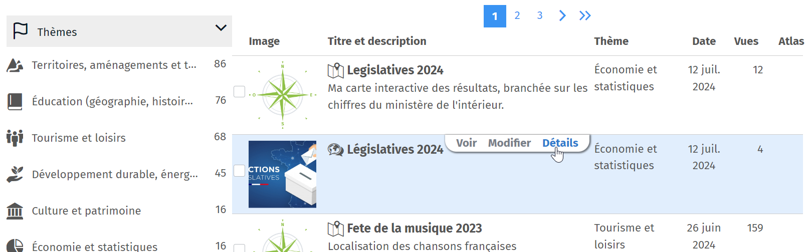

- macarte
- partage
- url
- iframe
- intégrer

Les cartes sont accessibles directement sur le web au travers d'une adresse (URL), qu'il vous suffit de transmettre (par mail par exemple).
Vous pouvez aussi partager votre carte avec un QR Code lisible sur un Smartphone que vous pourrez intégrer sur une affiche ou un document.
Sur les pages de création de cartes, l'icône <i class="fi-share-alt"></i> dans la barre de menu permet de partager la carte par URL, au travers d'un widget (iFrame) à [intégrer sur un site internet](#./Comment_intégrer_une_carte_sur_un_site.md) ou sur les réseaux sociaux (X/Twitter, Facebook, LinkedIn).
Vous pouvez ajouter vos cartes dans l'Atlas de Ma carte afin de permettre aux internautes d'y accéder plus facilement.

Vous retrouverez également ces options sur la page de la [carte sur votre compte](https://macarte.ign.fr/mon-compte/#cartes) en cliquant sur le bouton `Détail` de votre carte.

Sur cette page vous trouverez également un lien de partage en édition pour [travailler à plusieurs sur votre carte](#../equipe/Comment_travailler_à_plusieurs_sur_une_carte.md).

Si vous ne souhaitez pas que votre carte puisse être vue par une autre personne que vous, en décochant la case "Carte active" vous serez le seul utilisateur à pouvoir la consulter.

Vous pouvez aussi [créer des équipes](#../equipe/Comment_travailler_en_équipe.md) afin d'avoir un meilleur contrôle sur la manière de partager une carte.

1. [Où trouver le QR Code de partage](./Où_trouver_le_QR_Code_de_partage.md)
1. [Comment intégrer une carte sur mon site ?](./Comment_intégrer_une_carte_sur_un_site.md)
2. [Comment travailler à plusieurs sur une carte ?](../equipe/Comment_travailler_à_plusieurs_sur_une_carte.md)
3. [Qui peut voir mes cartes ?](../equipe/Qui_peut_voir_mes_cartes.md)
4. [Parle-moi de l'Atlas](./Parle-moi_de_l'atlas.md)
