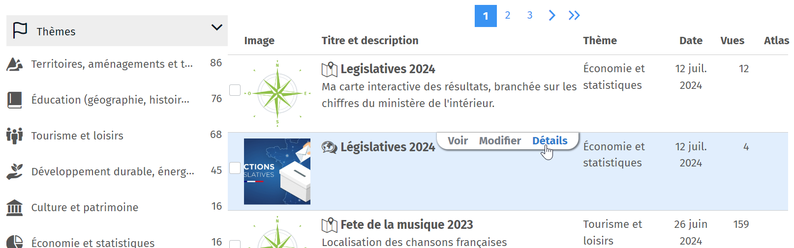
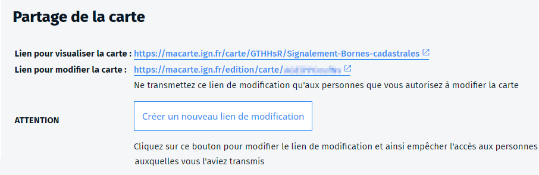

- travail
- travailler
- plusieurs
- collaboratif
- collaborer
- éditer
- carte

Lors que vous avez créé une carte, vous pouvez partager un **lien en édition** avec d'autres utilisateurs de Ma carte.
Vous retrouverez ce lien sur la page de la [carte sur votre compte](https://macarte.ign.fr/mon-compte/#cartes) en cliquant sur le bouton `Détail` de la carte.

Toute personne ayant ce lien peut accéder à la carte et la modifier. Ce peut être utile si vous voulez travailler à plusieurs sur la carte.

⚠️ Il n'y a pas de contrôle sur qui modifie la carte. Si deux personnes modifient la carte en même temps, ce sont les modfication de la dernière qui enregistre qui seront prisent en compte.
⚠️ Faites attention à qui vous communiquez l'adresse de modification.
Vous pouvez à tout moment `Créer un nouveau lien de modification` en cliquant sur le bouton sur la page de la carte. Dans ce cas, l'ancien ne sera plus actif.

1. [Comment partager une carte](./Comment_partager_une_carte.md)