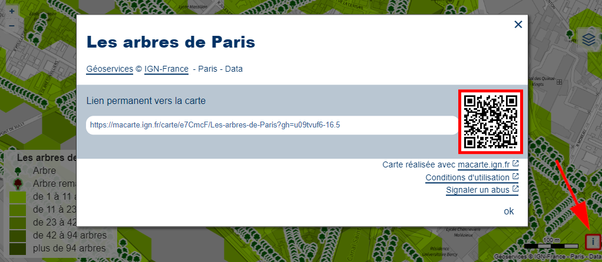

- QRCode
- QR code
- partage

Un QR Code (Quick Response Code) est disponible sur la page de visualisation de la carte en cliquant sur le bouton [i] en bas à droite de la carte.

Ce QR Code peut être placé sur une affiche ou un document pour faciliter l'accès à la carte avec un smartphone ou une tablette.

1. [Comment partager une carte ?](./Comment_partager_une_carte.md)
1. [Comment imprimer une carte ?](./Comment_imprimer_une_carte.md)