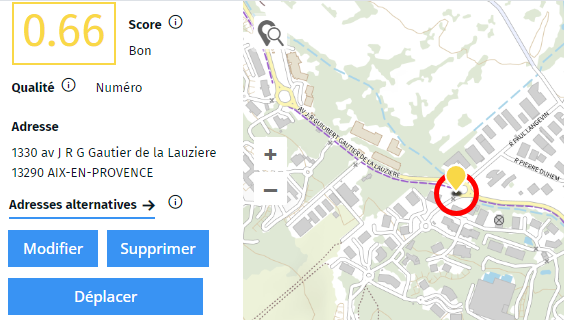

- géocoder
- adresse
- erreur
- corriger
- correction
- géocodage

Si une adresse est mal positionnée, l'outil propose généralement des adresses alternatives dans le panneau de gauche. 
Ce sont des adresses ressemblant à celles proposée (mais avec un score inférieur). Vous pouvez alors choisir dans la liste proposée.

Si cela ne suffit pas, lorsqu'un point est sélectionné, deux options s'offrent à vous dans le panneau de gauche : 
- Modifier l'adresse que vous propose de corriger l'adresse et de relancer un géocodage.
- Déplacer manuellement un point qui vous permet de bouger le point sur la carte. Une fois le déplacement validé, l'outil recalcule un géocodage sur cette nouvelle position

1. [Qu'est-ce que le score de géocodage ?](./Qu'est-ce_que_le_score_de_géocodage.md)
1. [Qu'est-ce que l'indice de qualité du géocodage ?](./Qu'est-ce_que_l'indice_de_qualité_du_géocodage.md)