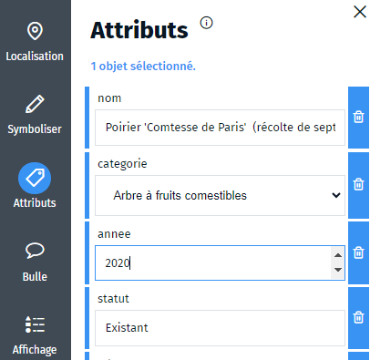

- attribut
- attributs
- objet
- paramètre
- propriété
- information descriptive

L'information géographique est la représentation d'un objet ou d'un phénomène dans l'espace.
Afin de décrire les propriétés des objets, on leur adjoint des attributs. Ainsi, lorsque vous aurez [saisi un nouvel objet](#./Comment_saisir_des_objets_dans_Ma_carte.md) ou lorsque vous [sélectionnez un objet](#../selection/Comment_sélectionner_des_objets.md) vous pouvez consulter, modifier ou ajouter des attributs dans l'onglet `Attributs` <i class="fi-tag colored"></i>.

Les attributs d'une couche peuvent [être personnalisés](#./Comment_personnaliser_les_attributs_d'une_couche_vecteur.md) afin de faciliter leur saisie et d'assurer la cohérence sur la couche.
Il est possible d'afficher les attributs d'un objet sous forme d'[étiquettes sur la carte](#../symboliser/Comment_mettre_en_forme_une_étiquette_sur_la_carte.md) ou dans l'[info-bulle de l'objet sélectionné](#../md/Afficher_des_attributs_en_Markdown.md).
Enfin, les attributs peuvent servir à représenter les objets à l'aide d'une [symbolisation paramétrique](#../symboliser/Qu'est-ce_qu'une_représentation_paramétrique.md).

1. [Comment personnaliser les attributs d'une couche ?](./Comment_personnaliser_les_attributs_d'une_couche_vecteur.md)
1. [Qu'est-ce qu'une représentation paramétrique ?](../symboliser/Qu'est-ce_qu'une_représentation_paramétrique.md)
1. [Comment afficher les attributs d'un objet en Markdown ?](../md/Afficher_des_attributs_en_Markdown.md)

