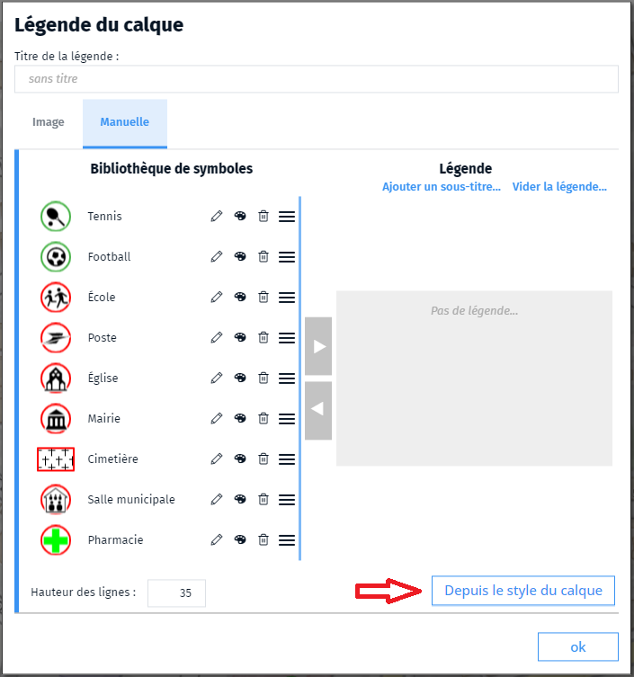

- légende
- legende
- couche
- calque
- layer

Il est possible d'ajouter une légende aux couches dans le gestionnaire de couche de l'outil de création de cartes <i class="fg-map-legend"></i>.
Vous pouvez créer une légende à partir d'une image existante ou de toute pièces (mode manuel) avec les symboles disponibles dans la bibliothèque de symboles.
Si la couche est un WMS qui a une légende (image) indiquée dans le flux, vous pouvez demander à utiliser celle-ci. 

💡 Si vous utilisez des styles paramétrique dans le calque, en cliquant sur le bouton `Depuis le style` du calque tous les styles paramétrés sont automatiquement insérés dans la légende du calque avec leur nom.

📝 la légende du calque n'est pas automatiquement intégrée dans la légende de la carte. 
Pour cela vous devez l'ajouter à la légende de la carte via le menu <i class="fg-map-legend colored"></i> `Affichage`. 
💡 la légende ne s'affiche pas si la couche est masquée.

1. [Comment ajouter une légende à ma carte ?](./Comment_créer_une_légende.md)
1. [Comment créer une bibliothèque de symboles ?](../symboliser/Comment_créer_une_bibliothèque_de_symboles.md)
1. [Qu'est-ce qu'une représentation paramétrique ?](../symboliser/Qu'est-ce_qu'une_représentation_paramétrique.md)
