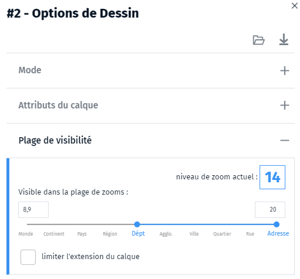

- optimiser
- améliorer
- affichage
- carte
- cluster
- affichage image
- mode image

La lenteur d'affichage peut avoir plusieurs origines dont certaines ne dépendent pas de l'application Ma carte : surcharge du réseau, serveur de données surchargé, terminal déficient.
Cependant, les données vecteur que vous chargez peuvent conduire à des ralentissements voire un blocage total. Il n'y a pas de limite théorique mais la pratique conduit à déconseiller les fichiers de plus de **50 Mo**.
Lorsque vous chargez un fichier volumineux, il est fortement conseillé de paramétrer **son mode de visualisation**, accessible via le bouton de configuration du calque <i class="fi-configuration"></i> en bas du gestionnaire de couche.

Les modes conseillés sont :
- **cluster** qui regroupe les objets en un seul selon des paramètres personnalisables de proximité et de zoom. En plus d'accélérer l'affichage, la lisibilité de votre carte est meilleure.
- **image** qui va fluidifier l'affichage (sans recalculer l'image de la carte lors des déplacements).

📝 L'inconvénient de ce mode est que l'affichage ne va pas suivre la rotation de la carte.
Aussi, si vous avez des étiquettes ou des symboles qui s'affichent sur cette couche ils vont se retrouver penchés, ce qui peut nuire à la lisibilité.

Vous pouvez également limiter les plages de zooms dans lesquels le calque va s'afficher.
Généralement, lorsque vous avez beaucoup de données, à petit zoom elles viennent se superposer et rendent la carte illisible. Il est alors conseillé de ne pas les afficher à partir d'un certain zoom. Il est possible par contre d'afficher une couche allégée, plus synthétique, qui représentera le phénomène observé à cette échelle qui s'affichera aux niveau de zoom pour lesquels la couche est masquée.

L'utilisation de flux tuilés est aussi recommandée : WMTS plutôt WMS et tuiles vectorielles plutôt que WFS.

Pour les statistiques impliquant de nombreux îlots IRIS, communes ou EPCI, il faut choisir la version du maillage "allégé" à la création de la statistique.

1. [Qu'est-ce que le mode cluster ?](./Qu'est-ce_que_le_mode_cluster.md)
1. [Comment optimiser une carte statistique ?](../mcstat//Comment_optimiser_une_carte_statistique.md)
