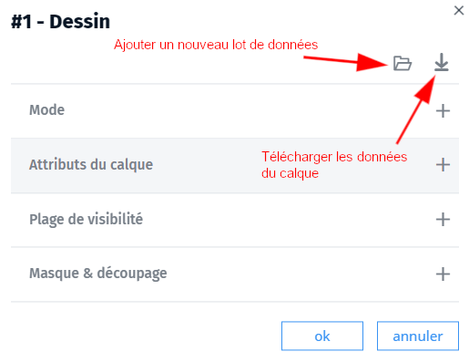

- mettre à jour
- mise à jour
- couche
- layer
- data
- dessin

Dans le module d'édition, il est possible de remplacer ou ajouter des données dans un calque de dessin en chargeant un nouveau lot de données dans le dialogue d'options du calque via le gestionnaire de calque .

Les nouvelles données vont venir se charger dans le calque. 
💡 Vous pouvez choisir de remplacer les données existante en cochant l'option dans le dialogue.

Si le calque a un style paramétrique, celui-ci s'appliquera automatiquement aux nouvelles données.

1. [Qu'est-ce qu'une représentation paramétrique ?](../symboliser/Qu'est-ce_qu'une_représentation_paramétrique.md)
