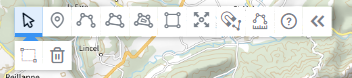

- dessin
- couche
- saisie
- saisir

Une couche de dessin est une couche sur laquelle on va pouvoir accéder, modifier et ajouter de nouveaux objets à travers l'[outil de création de cartes](https://macarte.ign.fr/edition/carte).
Vous pouvez avoir autant de couche de dessin que vous voulez (via le gestionnaire de couches )

La saisie de nouvelles données se fait à l'aide des outils de dessin en haut de l'écran.

Cliquer sur le  pour accéder à une aide complète.

La saisie se fait dans la couche active (en surlignée bleu dans le gestionnaire de couche).

Vous pouvez saisir des points, de ligne ou des surface ainsi que des trous dans ses surface.
Des options vous permettent également de vous accrocher aux objets existants ou d'afficher une mesure lors de la saisie.

1. [Quels sont les raccourcis claviers ?](./Quels_sont_les_raccourcis_claviers_de_dessin.md)
1. [Comment symboliser un objet ?](../symboliser/Comment_symboliser_un_objet.md)
1. [Parle-moi du gestionnaire de couche](./Parle-moi_du_gestionnaire_de_couche.md)
