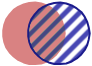
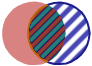
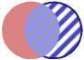
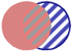
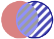

- mode de fusion
- fusion
- combiner

Les modes de fusion permettent de définir la façon dont la couche va se combiné avec les couches inférieurs.

Il existe différents modes de fusion :
*  **Normal :** Il s'agit du mode par défaut. Le calque va s'afficher par dessus les autre calque et venir masquer ceux-ci.
*  **Produit :** Les couleurs du calque vont venir se combiner avec celle du calque inférieur comme si on dessinait avec un marqueur. La couleur finale est toujours plus foncée. Le produit d'une couleur quelconque par le noir rend du noir. Le produit d'une couleur quelconque par le blanc n'a aucune incidence sur la couleur.
*  **Superposition :** Ce mode est l'inverse du produit. La couleur finale est toujours plus claire. Une superposition avec le noir n'a aucune incidence sur la couleur. Une superposition avec le blanc produit du blanc.
*  **Recouvrement :** Cet effet combine le mode produit et superposition. Lorsque la couche de base est claire, la couche supérieure devient plus claire ; là où la couche de base est sombre, le dessus devient plus sombre; là où la couche de base est gris moyen, le dessus n'est pas affecté.
*  **Obscurcir :** Les pixels plus clairs que la couleur de fusion sont remplacés, et les pixels plus foncés demeurent intacts.
*  **Eclaircir :** C'est l'inverse, les pixels plus foncés que la couleur de fusion sont remplacés, et les pixels plus clairs demeurent intacts.
*  **Densité couleur + :** L'effet vient obscurcir la couleur du dessous par la couleur du calque par augmentation du contraste entre les deux. La fusion avec du blanc ne produit aucun effet.
*  **Densité linéaire + :** L'effet vient éclaircir la couleur du dessous par la couleur du calque par réduction du contraste entre les deux. L'effet' avec du noir ne produit aucun effet.
*  **Lumière crue :** Cet effet équivaut à projeter une lumière crue sur une image.
*  **Lumière douce :** Cet effet équivaut à projeter une lumière diffuse sur l'image.
*  **Différence :** Cet effet soustrait la couleur de base de la couleur du calque, ou inversement, en fonction de la couleur la plus lumineuse. L'effet avec du blanc inverse les valeurs de la couleur de base. L'effet avec du noir ne produit aucun effet.
*  **Exclusion :** Cet effet est semblable au mode Différence avec un moindre contraste.
*  **Teinte** Cet effet va appliquer la teinte du calque aux calques inférieurs.
*  **Saturation :** Cet effet va appliquer la saturation de la couleur du calque aux calques inférieurs. Ce mode ne produit aucun effet sur une zone non saturée (avec une valeur de gris égale à 0).
*  **Couleur** Cet effet va appliquer la couleur et la saturation du calque aux calques inférieurs. Ce mode préserve les niveaux de gris de l'image et est pratique pour colorer des images monochromes ou pour teinter des images en couleurs.
*  **Luminosité :** Cet effet va appliquer la luminance du calque au calques inférieurs. Ce mode crée l'effet inverse de celui du mode Couleurs.

1. [Le gestionnaire de couche](./Parle-moi_du_gestionnaire_de_couche.md)
1. [Ajouter un filtre à une couche](./Ajouter_un_filtre_à_une_couche.md)