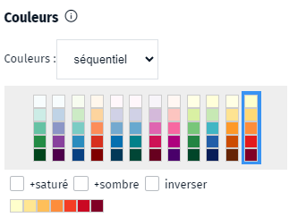

- statistique
- couleur
- couleurs
- palette

Les palettes proposées sont des combinaisons de couleurs sélectionnées pour leurs propriétés perceptives dans l'optique de la visualisation de données.

Ces palettes ont été créés par [Cynthia Brewer](http://www.colorbrewer2.org/) à des fins de cartographie, mais ont également trouvé une utilisation dans bien d'autres domaines.

### Le défi

Un choix de couleurs efficaces pour l'affichage de données statistiques (graphique de barres, camemberts, carte statistique, thématique ou de chaleur) est d'autant plus difficile que la façon dont nous choisissons la couleur ne reflète pas la façon dont la nous percevons.

Il existe de nombreux exemples de mauvaises combinaisons de couleurs publiés sur le web. Ainsi, des catégories encodées avec une combinaison de couleurs claires et sombres, donneront une préférence aux couleurs vives qui vont dominer l'attention du lecteur.
D'autre part, si deux couleurs semblent similaires, le lecteur va instinctivement les percevoir comme appartenant à un groupe et en déduire que les variables sous-jacentes sont liées.

Les couleurs avec un faible contraste (dont la luminosité est perçue similaire) ou avec un contraste simultané (couleurs pures) interfèrent également avec les mécanismes d'interprétation.

### Les différents types de Palettes
Il existe quatre types de palettes :
* **coloré** : ce sont des palettes séquentielles à une seule valeur, elles utilisent un dégradé à partir d'une couleur de base
* **séquentiel** : les couleurs ont un ordre perçu avec une différence entre couleurs successives uniformes. Elles sont adaptées pour des données ordonnées avec une variation de valeur continue (gradient).
* **divergent** : elles utilisent deux palettes séquentielles dos à dos à partir d'une couleur commune. Elles accordent la même importance aux différentes valeurs des données.
* **qualitatif** - les couleurs n'ont pas d'ordre perçu. Elles sont adaptées pour représenter des données catégorielles ou nominales.

### Personnalisation des couleurs
Afin de maximiser la différenciation des couleurs entre elles, les palettes proposées dépassent	rarement 10 classes.
Or,
* pour certains types de configuration spatiale, il peut être utile d'avoir plus de 10 classes
* pour des données catégorielles, il peut être intéressant de pouvoir choisir la couleur d'une catégorie
* pour valoriser la mise en exergue d'un phénomène on peut avoir recours à une couleur tranchée pour la classe concernée

1. [Faire une carte statistique](./Comment_créer_une_carte_statistique.md)
1. [Quels sont les types de cartes statistiques ?](./Quels_sont_les_types_de_cartes_statistiques_proposés.md)
1. [Quels sont les méthodes de classification proposées ?](./Les_méthodes_de_classification.md)
