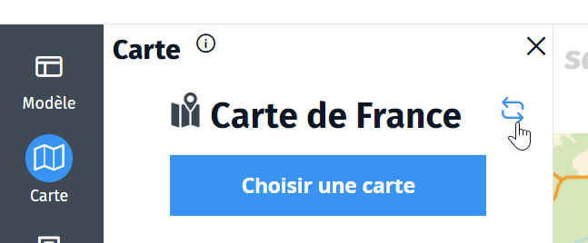

- narration
- storymap
- carte narrative
- modifier

Une carte narrative est un conteneur qui contient une ou plusieurs cartes préalablement réalisée avec Ma carte (suivant le modèle de narration choisi).

L'information géographique est contenue dans la ou les cartes qui composent la carte narrative.
Si vous souhaitez modifier le contenu d'une carte narrative, il faut intervenir dans la carte (ou les cartes) qui la compose(nt) en utilisant l'[éditeur Ma carte](#../mceditor/créer_une_carte.md).

Seuls les paramètres de mise en forme sont modifiables dans l'interface de Ma carte narrative :
* un titre et un sous-titre
* des couleurs de fond et de texte personnalisées pour valoriser vos réalisations, respecter une charte graphique
* l'adjonction d'un logo pour signer votre identité
* des widgets pour faciliter l'utilisation de la carte : recherche d'adresse, gestionnaire de calques, outils de mesure, outils de croquis, coordonnées du pointeur, légende, ...
* la configuration des info-bulles et volets
* l'affichage d'une description pour apporter à l'internaute des informations complémentaires sur la narration.

Les narrations plus complexes peuvent contenir d'autres éléments (les étapes par exemple).

Si vous modifiez une carte (dans le module d'édition) pour voir apparaître les modification dans la carte narrative vous devez cliquer sur le bouton rafraîchir (<i class="fi-repeat"></i>) dans l'onglet carte.

1. [Quels sont les modèles de carte narrative proposés ?](./Quels_sont_les_modèles_de_carte_narrative_proposés.md)
1. [Montre-moi des exemples de cartes narratives](./exemples_de_cartes_narratives.md)
