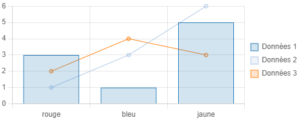

- Markdown
- MD
- diagramme
- statistique
- camembert
- pie chart
- info-bulle
- infobulle
- widget

Il est possible d'afficher des diagrammes dans les info-bulles ou dans les textes de vos narrations.
Pour cela, vous devez utiliser un widget Markdown `chart`
```
&#96chart
data: 3;1;5
&#96
```
Différentes options et types de diagrammes sont disponibles : bâtons (verticaux ou horizontaux), lignes, circulaire, radar et vous pouvez mixer des lignes et des barres.


Vous pouvez également utiliser les attributs de l'objet sélectionné pour afficher un diagramme spécifique à la sélection.

💡 Pour plus d'informations, consultez l'aide en ligne disponible dans la barre de Markdown.

1. [Afficher des attributs en Markdown](./Afficher_des_attributs_en_Markdown.md)
1. [Montre-moi la barre de Markdown de Ma carte](../md/la_barre_de_Markdown_de_Ma_carte.md)
1. [Qu'est-ce que le Makdown ?](../md/markdown.md)
