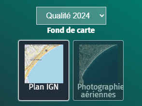

- filtrer
- filtrage
- widget
- MD
- couche
- layer

Pour afficher un gestionnaire de couche dans une narration (sur une étape ou dans la description d'une carte), utilisez le widget `layerSwitcher`. Il faut lui indiquer les identifiants des couches à gérer (`layer`). Pour vous aider à récupérer l'identifiant de la couche, utilisez l'outil <i class="fg-layer-stack-o"></i> de la barre de Markdown étendue.
Si vous spécifiez plusieurs couche (séparées par de espaces), elles s'afficheront / masqueront en même temps.


```md
&#96layerSwitcher center
layer: 1
layer: 2 3
className: maClasse
background: rgba(255,255,255,0.5)
&#96
```
Vous pouvez spécifier la classe du widget (`className` pour utilisation avec une feuille de style personnalisée).
Vous pouvez modifier la couleur du fond du widget (`background`) et lui ajouter une bordure (`border: 1`).

Le widget propose 3 types d'affichage : 
- case à coché (par défaut),
- menu (`type: menu`), 
- ou boutons (`type: button`)
Il est possible de rendre les affichages exclusifs en ajoutant l'option `radio: 1`. <br/> Dans ce cas, l'affichage d'une couche masquera les autres (avec le type menu, l'affichage est toujours exclusif, seule la couche sélectionnée dans le menu est visible).

NB : Si la couche a un logo paramétré (via <i class="fa fa-info-circle"></i> `+ de paramètres...`) celui s'affichera.
NB : Pour l'affichage d'un bouton, il est possible de définit la taille d'un bouton sous la forme `size: longueurxlargeur`

Par exemple pour afficher 2 gestionnaires de couches une sous forme de menu (pour choisir parmi les couches "qualité" : 7, 9, 10 ou 11) et pour le choix d'un fond de carte (couche "carte" : 4 et 5 ou couche "photo" : 6) sous forme de bouton.

```md
&#96layerSwitcher
layer: 7
layer: 9
layer: 10
layer: 11
radio: true
type: popup
background: rgba(255,255,255,0.25)
&#96

|	**Fond de carte**
&#96layerSwitcher center
className: test
size: 105x125
radio: true
type: button
layer: 4 5
layer: 6
background: #212d38 
&#96
```



1. [En savoir plus sur les widgets Markdown](../md/En_savoir_plus_sur_les_widget_Markdown.md)
1. [Ajouter un filtre sur les données](../md/Ajouter_un_filtre_sur_les_données.md)