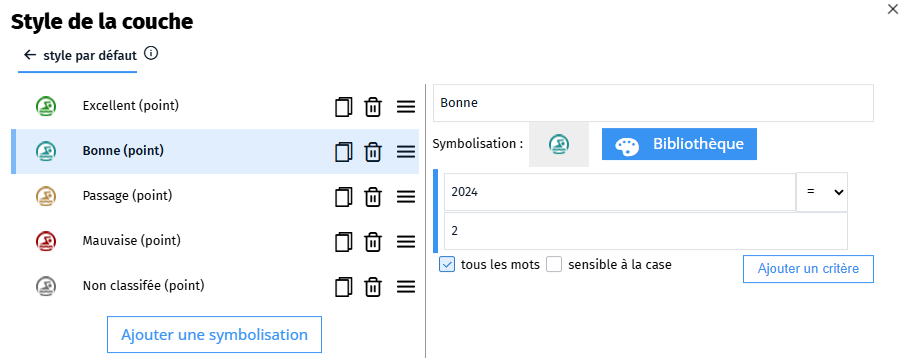

- filtrer
- filtrage
- widget
- MD
- symbolisation
- paramétrique
- couche
- layer

Si vous avez une couche dont l'affichage est piloté par une [symbolisation paramétrique](#../symboliser/Qu'est-ce_qu'une_représentation_paramétrique.md) vous pouvez proposer à vos utilisateurs un widget pour filtrer les données suivant le paramétrage configuré dans le style de la couche.

```md
&#96layerFilter
layer: 1
className: maClasse
background: rgba(255,255,255,0.5)
border: 1
&#96
```

Le widget `layerFilter` permet donc de filtrer une couche sur sa symbolisation paramétrique. Il peut se mettre dans une étape ou dans la description d'une carte narrative pour s'afficher dans le volet de la carte.
Il est possible de définir une couleur de fond (`background`) et d'afficher une bordure (`border`).

Ainsi, si la couche est paramétré de la forme :

Un filtre permettra de n'afficher sur la carte que les objets qui satisfont la condition définie pour le style :


NB : il est possible d'applique le filtrage sur plusieurs couches à condition qu'elles partage la même symbolisation en proposant plusieurs couches. Le numéro de la couche est disponible dans les options du gestionnaire de la couche (roue crantée) ou utilisez l'outil <i class="fg-layer-stack-o"></i> de la barre de Markdown étendu.

```md
&#96layerFilter
layer: 1
layer: 3
&#96
```

Il est possible de réinitialiser le filtre en ajoutant le paramètre `reset` en particulier dans une carte par étape pour afficher tous les objets de la couche au début de l'étape :
```md
&#96layerFilter
layer: 1
layer: 3
reset: 1
&#96
```

1. [Qu'est-ce qu'une représentation paramétrique ?](../symboliser/Qu'est-ce_qu'une_représentation_paramétrique.md)
1. [En savoir plus sur les widgets Markdown](../md/En_savoir_plus_sur_les_widget_Markdown.md)
1. [Afficher une gestionnaire de couche en Markdown](../md/Afficher_une_gestionnaire_de_couche_en_Markdown.md)