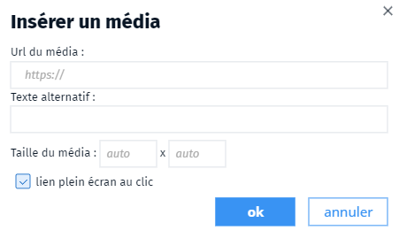

- media
- média
- markdown
- MD
- images
- vidéo
- twitter

La syntaxe pour intégrer un média dans Ma carte est la suivante : 
```MD

```

Il peut s'agir d'une image, d'une vidéo ou d'un fichier de son.
On peut aussi intégrer un tweet avec l'url du tweet.

Utilisez la barre de Markdown pour vous aider à intégrer les images. En particulier pour ajouter un lien d'affichage en plein écran sur une image.



Il est également possible d'intégrer un comparateur d'images
```
&#96imageSlider
img1: url_image_1
img2: url_image_2
fullscreen: true
&#96
```

💡 Pour plus d'informations, consultez l'aide en ligne disponible dans l'outil.

1. [Montre-moi la barre de Markdown de Ma carte](../md/la_barre_de_Markdown_de_Ma_carte.md)
1. [Qu'est-ce que le Makdown ?](../md/markdown.md)
