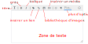
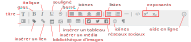

- Markdown
- MD
- édition
- barre

La barre d'outil de Ma carte vous permet d'ajouter plus facilement les balises Markdown dans vos créations.

En cliquant sur `plus d'options` un dialogue s'ouvre qui offre plus d'options et un espace pour visualiser le rendu du Markdown.

N'hésitez pas à consulter l'aide en ligne 

1. [Qu'est-ce que le Makdown ?](../md/markdown.md)
1. [Afficher des attributs en Markdown](./Afficher_des_attributs_en_Markdown.md)
