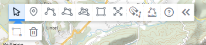
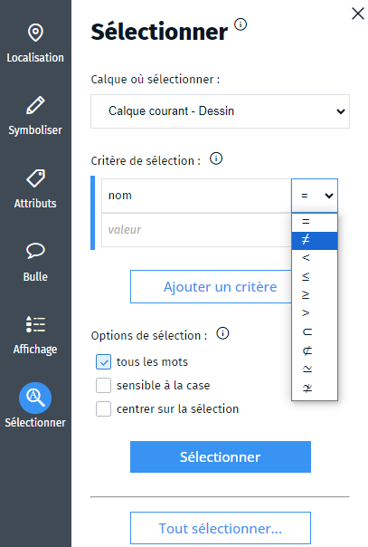

- sélection
- objet
- sélectionner
- filtrer
- recherche sur attribut

Il existe plusieurs façon pour sélectionner des objets sur Ma carte.
Tout d'abord, avec l'outil de sélection <i class="fg-arrow-o"></i>, au clic sur un objet d'une couche vecteur, lorsque la couche n'est pas verrouillée (<i class="fi-unlock"></i> dans le gestionnaire de calque).
En appuyant sur la touche <kbd>shift</kbd> + clic vous pouvez sélectionner plusieurs objets.
Vous pouvez également utiliser l'outil de sélection par emprise <i class="fg-extent"></i> pour sélectionner dans un rectangle sur le calque courant.

Vous pouvez également utiliser l'outil de recherche dans l'onglet `Sélectionner` <i class="fg-search-attribtues colored"></i> qui permet de faire une recherche sur les attributs des objets avec des [critères de sélection](#./opérateurs.md).

Une fois les objets sélectionnés, vous pouvez les supprimer (<i class="fi-trash"></i> dans la barre de dessin), leurs [appliquer un style](#../symboliser/Comment_symboliser_un_objet.md), leurs [ajouter des attributs](#../mceditor/Comment_ajouter_des_attributs_à_un_objet.md) ou [personnaliser leur info-bulle](#../mceditor/Comment_paramétrer_l'info-bulle_d'un_objet.md).

1. [Quels sont les opérateurs de sélection ?](../selection/opérateurs.md)
1. [Qu'est-ce qu'une couche vecteur ?](../mceditor/Qu'est-ce_qu'une_couche_vecteur.md)
1. [Comment saisir des objets ?](../mceditor/Comment_saisir_des_objets_dans_Ma_carte.md)
1. [Modifier les attributs d'un objet](../mceditor/Comment_ajouter_des_attributs_à_un_objet.md)