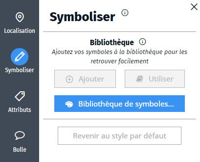

- bibliothèque
- symbole
- symboles

Une bibliothèque de symbole est un moyen pratique de recenser les symboles présents dans la carte pour les réutiliser pour symboliser un objet, pour les ajouter dans la légende ou pour créer une représentation paramétrique.
La bibliothèque de symbole est disponible dans l'onglet `Symboliser` <i class="fi-pencil colored"></i>.

Vous pouvez ajouter de nouveaux symboles à la bibliothèque :
- si un objet est sélectionné, vous pouvez ajouter sa représentation à la bibliothèque en cliquant sur le bouton `<i class="fi-add"></i> Ajouter` dans l'onglet `Symboliser`.
- dans le le dialogue de la bibliothèque, vous pouvez créer un nouveau symbole ou dupliquer un symbole existant dans la liste
- vous pouvez également copier un symbole de la légende dans la bibliothèque en passant par le dialogue de la légende, en sélectionnant la ligne de la légende et en cliquant sur la flèche bleue.

Vous pouvez également utiliser la bibliothèque de symbole d'une carte existante.

Vous pouvez appliquer un symbole de la bibliothèque à l'objet sélectionné via le bouton `<i class="fa fa-book"></i> Utiliser` dans l'onglet `Symboliser`.

1. [Comment utiliser la bibliothèque de symbole d'une carte existante ?](./comment_partager_une_bibliothèque_de_symboles.md)
1. [Qu'est-ce qu'une représentation paramétrique ?](../symboliser/Qu'est-ce_qu'une_représentation_paramétrique.md)
1. [Comment ajouter une légende à ma carte ?](../mceditor/Comment_créer_une_légende.md)
