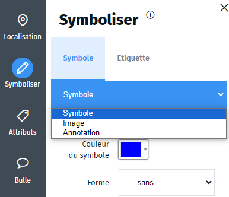

- symboliser
- symbole
- objet
- couleur
- couleurs

Vous pouvez symboliser l'objet sélectionné dans une couche de dessin via l'onglet `Symboliser` <i class="fi-pencil colored"></i>.

Vous pouvez choisir la couleur, la taille, la forme, le remplissage des objets à afficher.
La symbolisation dépend du type de l'objet (ponctuel, linéaire, surfacique).

Pour les objets ponctuels, Ma carte propose une liste symboles personnalisable, vous pouvez choisir la couleur et les inclure dans une forme (rond, carré, blason, etc.) afin d'harmoniser l'affichage sur la carte.

Vous avez la possibilité d'utiliser une image, sur le net ou dans votre galerie d'images. Le point peut aussi être une annotation, dans ce cas, seule l'étiquette associée va s'afficher.

Pour chaque objet, vous pouvez ajouter une étiquette, constituée d'un texte qui s'affiche sur la carte pour caractériser l'objet.
La mise en forme de l'étiquette sur la carte va dépendre du type d'objet auquel elle se rapporte.

1. [Comment ajouter des images à ma galerie ?](../macarte/Ma_carte_peut-il_héberger_des_images.md)
1. [Comment mettre en forme une étiquette sur la carte ?](./Comment_mettre_en_forme_une_étiquette_sur_la_carte.md)
1. [Bien utiliser la bibliothèque de symboles](./Comment_créer_une_bibliothèque_de_symboles.md)