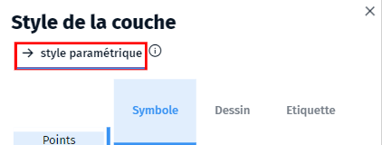
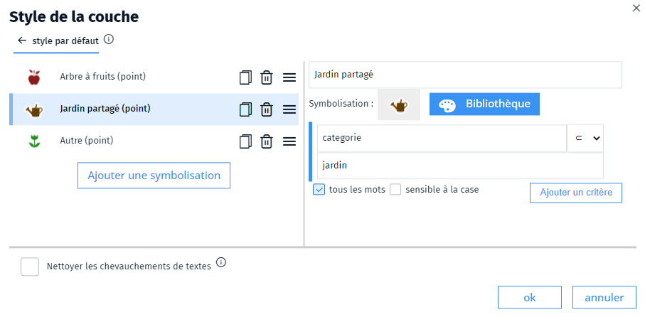

- symboliser
- symbole
- symbolisation
- paramétrique

Un symbolisation paramétrique est une manière de symboliser les objets **en fonction de leurs paramètres**.
Dans ce cas, la symbolisation ne sera plus portée par les objets individuellement mais par une règle de symbolisation sur le calque en fonction des attributs de l'objet (si le type est *gendarmerie*, le point s'affiche en bleu).

Sélectionnez la couche dans le gestionnaire de couches et rendez-vous sur le dialogue de style de la couche (bouton ) pour activer le style paramétrique.

Vous pouvez alors ajouter des symbolisations à la couche en fonction des attributs.

Vous devez au préalable avoir créé une bibliothèque de symboles correspondant à ce que vous désirez représenter.

Ensuite :
1. Cliquez sur `Ajoutez une symbolisation` 
2. Dans la partie droite, choisissez un symbole dans la bibliothèque (précédemment créée) et donnez un nom à la condition
3. Ajouter une règle de la forme `attribut` ➜ `opérateur` ➜ `valeur`

On peut ajouter plusieurs critères qui vont se cumuler si `tous les mots` est coché 

2. [Comment créer une bibliothèque de symboles ?](./Comment_créer_une_bibliothèque_de_symboles.md)
1. [Quels sont les opérateurs de sélection ?](../selection/opérateurs.md)
1. [Comment symboliser un objet ?](./Comment_symboliser_un_objet.md)