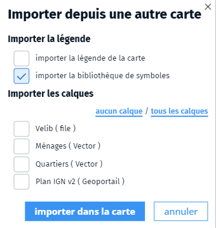

- partager
- utiliser
- bibliothèque
- symbole
- symboles
- existante

Vous pouvez charger la bibliothèque de symbole d'une carte existante pour la réutiliser dans votre carte.
Pour cela, rendez-vous dans le gestionnaire de couches et cliquez sur le bouton d'ajout <i class="fg-layer-alt-add-o"></i> dans la barre inférieure, puis cliquez sur `Depuis une autre carte...`. Sélectionnez ensuite la carte dans la liste proposée.
Dans le dialogue qui s'ouvre cocher `importer la bibliothèque de symboles` :

Vous pouvez également enregistrer une carte modèle sur votre ordinateur contenant la bibliothèque de symbole via le bouton <i class="fi-download"></i> de la barre de menus de l'éditeur de cartes. 
Le fichier `.carte` ainsi généré pourra être récupérée simplement par glissé/déposé sur la carte en cours de saisie. Vous pouvez également partager ce fichier avec d'autres utilisateurs en leur envoyant par mail, par exemple.

1. [Comment créer une bibliothèque de symboles ?](./Comment_créer_une_bibliothèque_de_symboles.md)
1. [Où est le gestionnaire de couche](../mceditor//Parle-moi_du_gestionnaire_de_couche.md)
1. [Qu'est-ce qu'une représentation paramétrique ?](../symboliser/Qu'est-ce_qu'une_représentation_paramétrique.md)
