# Chat - Ma carte

Je suis un chatbot programmé pour vous aider à utiliser les outils [**Ma carte**](https://macarte.ign.fr/) développés par l'Institut national de l'information géographique et forestière (IGN).


Vous pouvez écrire votre question, ou bien vous laisser guider par les propositions ci-dessous.

1. [Qu'est ce que Ma carte ?](macarte/macarte)
2. [Comment créer une carte en ligne ?](mceditor/créer une carte)
3. [Localiser une couche d'adresse](mcadresse/Localiser une couche d'adresse)
4. [Créer une couche statistique](mcstat/Comment créer une carte statistique)
5. [Raconter une histoire sur une carte](mcstory/raconter une histoire)
6. [Qui est l'IGN ?](ign/Qui est l'IGN)

## Comment vas-tu ?
- vas-tu
- va-tu
- vas tu

Très bien, merci.

1. [Que puis-je faire pour vous ?](macarte/macarte)
1. [Montre moi des exemples de cartes](macarte/exemples)

## Qui es-tu ?
- es-tu
- qui es tu

Je suis un robot conversationnel programmé pour vous aider dans vos démarches.

1. [Qu'est-ce que Ma carte ?](macarte/macarte)
1. [Montre moi des exemples de cartes](macarte/exemples)

## Quel est ton nom ?
- appelles

Je suis un robot conversationnel et je n'ai pas de nom, mais tu peux m'appeler HAL-9000 !
Tu veux que je te chante une chanson ?

1. [Chante-moi une chanson](Chante-moi une chanson)
1. [Qu'est-ce que Ma carte ?](macarte/macarte)

## Chante-moi une chanson
- chanson
- chante

Voici une chanson !
<iframe width="560" height="315" style="margin: auto; display: block" src="https://www.youtube.com/embed/FzLneuWw5I0?si=lqebl5nFJfZ6gT1D" title="YouTube video player" frameborder="0" allow="accelerometer; autoplay; clipboard-write; encrypted-media; gyroscope; picture-in-picture; web-share" referrerpolicy="strict-origin-when-cross-origin" allowfullscreen></iframe>

1. [Qu'est-ce que Ma carte ?](macarte/macarte)
1. [Montre moi des exemples de cartes](macarte/exemples)

## equipe/Comment inviter des membres dans une équipe
- equipe
- inviter
- ajouter
- membre

Une équipe est constituée de membres qui peuvent voir ou modifier (lorsqu'ils sont rédacteurs) les cartes au sein de l'équipe.

Vous pouvez facilement ajouter des membres sur la [page de profil de votre équipe](https://macarte.ign.fr/mes-equipes/#profil)

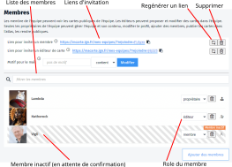

Pour ajouter un nouveau membre, vous pouvez soit leur envoyer un lien d'invitation, soit utiliser le bouton <button>Ajouter des membres</button> sous la liste des membres.

### Ajouter un membre

Dans le second cas, un dialogue vous propose de **rechercher un membre** dans la liste des utilisateurs de Ma carte pour l'inviter à participer à votre équipe. Vous devez connaître son nom public.

> 📧 Un mail est envoyé aux personnes lorsque vous les invitez dans une équipe ou lorsque vous changez leur rôle pour les avertir.

Tant que la personne n'aura pas validé l'invitation, le membre restera inactif dans la liste et il ne pourra pas participer.

Vous retrouverez sur la [page de gestion](https://macarte.ign.fr/mes-equipes/) de votre équipe la liste des invitations que vous avez reçues, en attente de validation.

### Envoyer un lien d'invitation

Vous pouvez également envoyer un **lien d'invitation** à la personne que vous voulez intégrer dans votre équipe. Si cette personne n'a pas de compte sur Ma carte, il devra en créer un avant de cliquer sur le lien.

Il existe deux liens d'invitation suivant que vous voulez inviter un simple membre ou un éditeur qui pourra modifier les cartes de l'équipe.
Il n'est pas possible d'ajouter directement un propriétaire à l'équipe via une invitation. Pour cela vous devrez modifier son rôle a posteriori.

Vous pouvez également ajouter un **motif de mail** afin de restreindre la portée du lien. Ainsi, en ajoutant un motif qui finit par `@organisme.fr`, vous vous assurez que quelqu'un qui recevrait le lien d'invitation et qui n'aurait pas un mail de votre organisme ne pourrait pas l'utiliser.

Vous pouvez à tout moment supprimer le lien d'invitation ou en générer un nouveau, lorsque votre campagne d'inscription se termine.

> 💡 Pensez à remplir le profil de votre équipe avant d'inviter de nouveaux membres afin de bien expliquer le but de l'équipe et ce que vous en attendez. 

1. [Comment travailler en équipe ?](equipe/Comment travailler en équipe)
1. [Quels sont les rôles au sein d'une équipe ?](equipe/Quels sont les roles au sein d'une équipe)
1. [Qui peut voir les cartes d'une équipe ?](equipe/Qui peut voir les cartes d'une équipe)
1. [Comment travailler à plusieurs sur une carte ?](equipe/Comment travailler à plusieurs sur une carte)


## equipe/Comment travailler en équipe
- equipe
- équipe
- partager
- plusieurs
- collaborer
- travailler

Les équipes sont des espaces partagés dans lesquels vous pouvez collaborer et partager des cartes avec d'autres utilisateurs de Ma carte (les membres de l'équipe).
Vous pouvez créer autant d'équipes que vous voulez, pour cela, [rendez-vous sur l'espace dédié](https://macarte.ign.fr/mes-equipes/) dans le menu utilisateur.

Les cartes publiées dans une équipe ne sont visibles que par les autres membres de l'équipe et seuls [les éditeurs](#equipe/Quels sont les roles au sein d'une équipe) peuvent rédiger des cartes dans l'équipe.
Vous pouvez également choisir de publier une carte dans l'atlas et, dans ce cas, elle sera visible par tous.

Vous pouvez [ajouter des membres](#equipe/Comment inviter des membres dans une équipe) à vos équipes et leur donner [des rôles spécifiques](#equipe/Quels sont les roles au sein d'une équipe).

Les équipes ont des pages dédiées visibles sur le site de Ma carte et sur lesquelles sont listées les cartes publiées dans l'atlas (atlas de l'équipe).
Vous pouvez également retrouver la liste des équipes auxquelles vous participez sur [la page dédiée de votre espace personnel](https://macarte.ign.fr/mes-equipes/).
Pour chaque équipe vous pouvez consulter les cartes publiques de l'équipe et, si vous êtes éditeur de l'équipe, la liste de cartes auxquelles vous avez accès. En tant que propriétaire d'une équipe, vous avez également aux fonctionnalités d'administration.

Vous pouvez changer d'équipe à tout moment dans le menu utilisateur. Cependant, ce faisant, vous perdrez les données en cours d'édition dans une autre équipe.

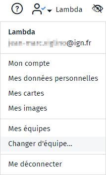

Lorsque vous êtes connecté sur une équipe le nom et le logo de l'équipe viennent s'afficher dans la ligne de titre.


1. [Comment inviter des membres dans une équipe](equipe/Comment inviter des membres dans une équipe)
1. [Quels sont les rôles au sein d'une équipe ?](equipe/Quels sont les roles au sein d'une équipe)
1. [Qui peut voir les cartes d'une équipe ?](equipe/Qui peut voir les cartes d'une équipe)
1. [Comment travailler à plusieurs sur une carte ?](equipe/Comment travailler à plusieurs sur une carte)
1. [Travailler à plusieurs sur une carte](equipe/Comment travailler à plusieurs sur une carte)

## equipe/Comment travailler à plusieurs sur une carte
- travail
- travailler
- plusieurs
- collaboratif
- collaborer
- éditer
- carte

Lorsque vous avez créé une carte, vous pouvez partager un **lien en édition** avec d'autres utilisateurs de Ma carte.
Vous retrouverez ce lien sur la page de la [carte sur votre compte](https://macarte.ign.fr/mon-compte/#cartes) en cliquant sur le bouton `Détail` de la carte.
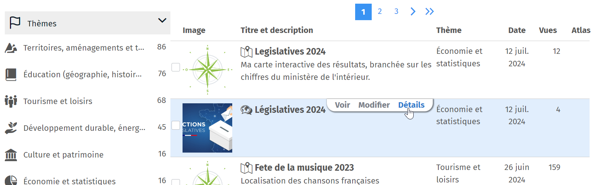

Toute personne ayant ce lien peut accéder à la carte et la modifier. Ce peut être utile si vous voulez travailler à plusieurs sur la carte.
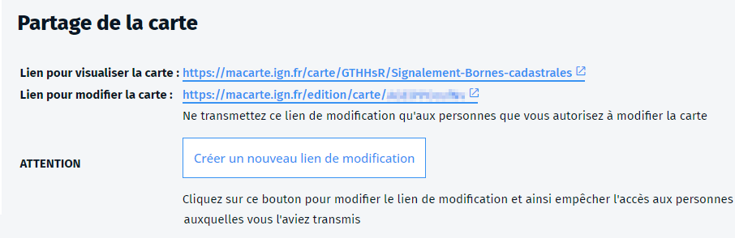

⚠️ Il n'y a pas de contrôle sur qui modifie la carte. Si deux personnes modifient la carte en même temps, ce sont les modifications de la dernière qui enregistre qui seront prises en compte.
⚠️ Faites attention à qui vous communiquez l'adresse de modification.
Vous pouvez à tout moment `Créer un nouveau lien de modification` en cliquant sur le bouton sur la page de la carte. Dans ce cas, l'ancien ne sera plus actif.

### Travailler en équipe

Vous pouvez aussi [créer des équipes](#equipe/Comment travailler en équipe) pour segmenter le partage de vos cartes et avoir un meilleur contrôle sur la manière d'éditer une carte.
Dans ce cas, les cartes carte publiques ne sont visibles que par [les membres de l'équipe](#equipe/Quels sont les roles au sein d'une équipe) et seuls les éditeurs peuvent modifier une carte.

1. [Comment partager une carte](macarte/Comment partager une carte)
1. [Comment travailler en équipe ?](equipe/Comment travailler en équipe)
1. [Qui peut voir mes cartes ?](equipe/Qui peut voir mes cartes)

## equipe/Quels sont les roles au sein d'une équipe
- roles
- role
- rôle
- droit
- membre
- editeur
- éditeur
- propriétaire

Les membres d'une équipe ont des rôles différents qui leur donnent plus ou moins de droits sur les cartes publiées dans l'équipe.

### <i class="fi-pro"></i> Le propriétaire de l'équipe 

C'est la personne qui a créé l'équipe.
Il peut administrer l'équipe, ajouter des membres pour voir les cartes et des éditeurs pour créer/modifier des cartes.
Il peut aussi nommer d'autres administrateurs pour l'aider à administrer l'équipe.

Il peut créer des cartes et les publier pour les rendre visibles ou envoyer un lien d'édition à un éditeur. <br/> Il peut aussi affecter un auteur à une carte (qui pourra plus facilement y accéder et la modifier).
Enfin, c'est lui qui gère les images de l'équipe.

### <i class="fi-author"></i> Les rédacteurs de l'équipe 

Les rédacteurs sont des membres qui peuvent [créer et modifier des cartes au sein de l'équipe](#equipe/Qui peut voir les cartes d'une équipe).
Ils ont accès aux cartes dont ils sont l'auteur et aux cartes privées de l'équipe si un administrateur leur envoie un lien de modification.

### <i class="fi-simple-user"></i> Les membres de l'équipe 

Les membres de l'équipe peuvent voir les cartes publiques de l'équipe.
Ils n'ont pas accès aux cartes privées et ne peuvent pas modifier de cartes dans l'équipe.

> 💡 En fonction des rôles de chacun et du statut des cartes les membres peuvent voir ou modifier les cartes au sein de l'équipe.
> [Voir les différentes possibilités...](#equipe/Qui peut voir les cartes d'une équipe)


1. [Qui peut voir les cartes d'une équipe ?](equipe/Qui peut voir les cartes d'une équipe)
1. [Comment travailler en équipe ?](equipe/Comment travailler en équipe)

## equipe/Qui peut voir les cartes d'une équipe
- équipe
- carte
- visibilité
- public
- privée
- atlas

Il existe deux façons d'accéder à une carte : soit via l'interface, soit via un lien (de visualisation ou d'édition).
Dans une équipe, on a [trois rôles différents](#equipe/Quels sont les roles au sein d'une équipe) (membres, éditeurs, propriétaires) et des utilisateurs qui n'appartiennent pas à l'équipe (hors équipe). On distingue aussi les éditeurs qui sont auteurs d'une carte (et qui ont des droits spécifiques).
Enfin, on a trois types de cartes : les cartes privées (en cours de rédaction), les cartes publiques (visibles dans l'organisation) et les cartes dans l'atlas (visibles en dehors de l'organisation).

### Qui peut voir une carte dans une équipe ?

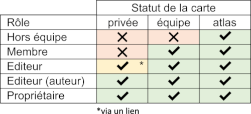

> 💡 Les cartes privées ne sont visibles que par les propriétaires de l'équipe et l'auteur de la carte ou via un lien fournis par un propriétaire à un éditeur.
> Ce sont généralement des cartes en cours de rédaction.

### Qui peut modifier une carte dans une équipe ?

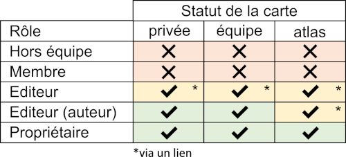


> 💡 Les cartes dans l'atlas sont figées et ne peuvent être modifiées que par les propriétaires de l'équipe ou via un lien fournis par un propriétaire. 

1. [Quels sont les rôles au sein d'une équipe ?](equipe/Quels sont les roles au sein d'une équipe)
1. [Comment travailler en équipe ?](equipe/Comment travailler en équipe)


## equipe/Qui peut voir mes cartes
- carte
- visibilité
- accessible
- atlas

Lorsqu'une carte est publiée (hors équipe, voir plus loin), elle est visible par tout internaute qui a accès au lien de publication fourni.
Vous pouvez choisir de publier vos cartes dans l'[Atlas](https://macarte.ign.fr/atlas/?mode=gallery), dans ce cas, elles seront référencées sur le site Ma carte et accessibles en recherche aux visiteurs du site et via les API.

Vous pouvez aussi choisir d'avoir des cartes privées mais vous seul pourrez les voir.

Afin de gérer plus finement les personnes qui peuvent voir- ou travailler sur des cartes, vous pouvez [créer des équipes](#equipe/Comment travailler en équipe) 

Dans une équipe, les cartes publiques ne sont visibles que par les [membres de l'équipe](#equipe/Quels sont les roles au sein d'une équipe). Pour qu'une carte soit visible par tous, elle doit être publiée dans l'Atlas. Les cartes privées ne sont accessibles qu'aux [éditeurs](#equipe/Quels sont les roles au sein d'une équipe) de l'équipe.

1. [A qui appartiennent les cartes produites sur Ma carte ?](macarte/A qui appartiennent les cartes produites sur Ma carte)
1. [Les cartes de l'Atlas](macarte/exemples)
1. [Comment travailler en équipe ?](equipe/Comment travailler en équipe)


## ign/Qui est l'IGN
- IGN
- qui est
- qui est l'IGN
- producteur
- réalisé
- produit
- diffuse
- Ma carte

L'Institut national de l'information géographique et forestière (IGN) est un établissement public à caractère administratif ayant pour mission d'assurer la production, l'entretien et la diffusion de l'information géographique de référence en France.


Il développe et diffuse des données à caractère géographique ainsi que des outils tels que Ma carte pour réaliser et publier des cartes en ligne.

[En savoir plus...](https://www.ign.fr/)

1. [Qu'est ce que Ma carte ?](macarte/macarte)
2. [Comment créer une carte en ligne ?](mceditor/créer une carte)
3. [Localiser une couche d'adresse](mcadresse/Localiser une couche d'adresse)
4. [Créer une couche statistique](mcstat/Comment créer une carte statistique)
5. [Raconter une histoire sur une carte](mcstory/raconter une histoire)

## macarte/Aller plus loins avec le widget carto
- iframe
- widget carto
- programmation
- iframeAPI
- api
- javascript

Si vous avez des besoins particuliers, vous aurez peut-être besoins de vous mettre à la programmation.
Pour cela, Macarte propose une iFrame-API qui permet d'intégrer une carte produite dans Ma carte sur votre site Web et de la contrôler à l'aide de JavaScript.
L'intégration des cartes se fait via une balise `<iframe>`, la configuration de la carte se fait simplement, de manière interactive sur le site Ma carte et vous pouvez vous concentrer sur le corps de votre métier.

### Les avantages de l'API
* la configuration de la carte se fait en mode interactif dans l'éditeur de Ma carte (no code)
* la carte peut être reprise à tout moment, mise à jour et une nouvelle version publiée
* pas besoins de connaissance particulière pour afficher la cartographie, c'est pris en charge par Ma carte
* vous pouvez vous concentrer sur la partie métier de votre application

Les fonctions de l'API JavaScript permettent d'afficher une carte, de contrôler sa position et son contenu et de récupérer des informations sur cette carte. Vous pouvez également ajouter des écouteurs d'événements qui s'exécutent en réponse à certaines actions déclenchées sur la carte tels qu'un déplacement ou une sélection d'objet entre autres.

> 💡 Par exemple, si vous êtes propriétaire d'une chaîne de magasins, vous pouvez créer une carte de manière interactive dans l'interface dédiée, choisir les fonds à afficher, ajouter vos données, les symboliser, ajouter une légende, des bulles, etc.
> Vous l'intégrez ensuite sur une page de votre site web et la centrez sur le magasin concerné, de la même manière que vous intégrez une image ou une vidéo.
> Avec l'iFrame-API vous pouvez de plus récupérer l'objet que le visiteur aura cliqué sur la carte (un magasin, un dépôt) et lui présenter des informations supplémentaires en interrogeant votre système d'information (horaires d'ouverture, disponibilité des stocks, etc.).

L'iFrame-API permet également d'ajouter [des outils d'édition](https://ignf-ma-carte.github.io/mcviewer/doc/api.html#addEditBar__anchor) pour créer des objets sur la carte. Vous pouvez ainsi intégrer facilement une carte sur un formulaire et, via l'API, récupérer les saisies faites par vos utilisateurs (attributs, géométrie) et les ajouter à la réponse de votre questionnaire !

[📔 Voir la documentation technique de l'iFrameAPI](https://ignf-ma-carte.github.io/mcviewer/doc/)

1. [Comment marche l'iFrameAPI ?](macarte/Comment marche l'iFrameAPI)
1. [Comment intégrer une carte sur mon site ?](macarte/Comment intégrer une carte sur un site)
1. [Comment partager une carte ?](macarte/Comment partager une carte)


## macarte/A qui appartiennent les cartes produites sur Ma carte
- propriété
- cartes
- responsabilité
- contenu

Vous restez propriétaire des cartes et des narrations que vous avez créées. A ce titre, vous êtes aussi responsable au sens RGPD des données que vous publiez sur internet via les Géoservices Ma carte. 
Ceci concerne toutes les informations que vous avez ajoutées, en particulier les images et leur contenu, les informations personnelles - propres ou de tiers – y compris si elles sont issues d'un géocodage.

Si une carte inclut des données, fonds de plan provenant de services non fournis par l'IGN et Ma carte, vous devez vous assurer d'en avoir les droits et de bien spécifier le copyright des couches dans les informations de la carte publiée.

Lorsqu'une carte est publiée au sein d'[une équipe](#equipe/Comment travailler en équipe), le propriétaire est également responsable de sa publication et du contenu qu'il diffuse.

1. [Qui peut voir mes cartes ?](equipe/Qui peut voir mes cartes)
1. [Comment créer une carte en ligne ?](mceditor/créer une carte)
1. [Comment travailler en équipe ?](equipe/Comment travailler en équipe)


## macarte/Comment imprimer une carte
- imprimer
- impression
- image
- exporter
- carte
- document
- JPG
- PNG
- PDF

Vous pouvez à tout moment imprimer une carte via l'outil d'impression <i class="fi-print"></i> dans l'outil d'édition.
Vous pouvez également ajouter cet outil dans votre narration pour permettre à vos lecteurs d'imprimer la carte.

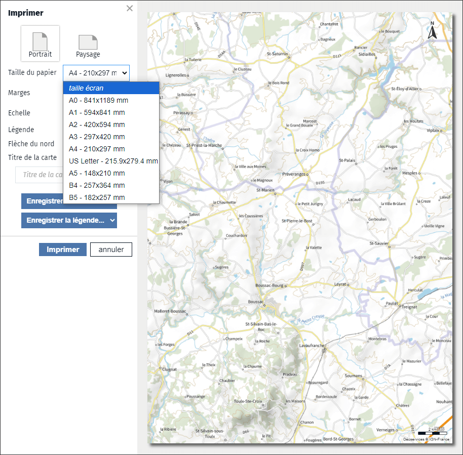

Vous pouvez imprimer la carte sur une imprimante, dans ce cas, vérifiez que les paramètres de l'imprimante correspondent bien à ceux spécifiés lors de la configuration de l'impression (taille du papier, orientation).
Vous pouvez également enregistrer une image de la carte au format PDF ou dans un fichier image (format JPG ou PNG) pour l'inclure dans un document.

1. [Pourquoi ma carte ne s'imprime pas ?](macarte/Problème pourquoi ma carte ne s'imprime pas)
1. [Comment partager une carte ?](macarte/Comment partager une carte)


## macarte/Comment intégrer une carte sur un site
- iframe
- intégrer
- macarte
- partage
- widget carte

Vous pouvez intégrer facilement votre carte sur votre site sous forme d'une iFrame.
Les outils d'édition propose une interface pour formater l'affichage du widget dans le menu de partage <i class="fi-share-alt"></i> puis en choisissant l'option `intégrer`.
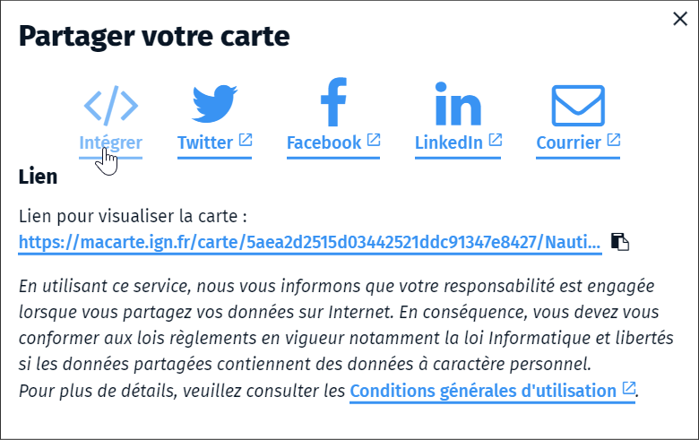

Il est possible de dimensionner la fenêtre d'affichage, de masquer le titre ou de positionner la carte à un endroit précis. Vous pouvez également interdire le zoom la molette pour éviter l'interaction avec le défilement sur votre site. Dans ce cas, le zoom se fera en tenant appuyé la touche contrôle du clavier.

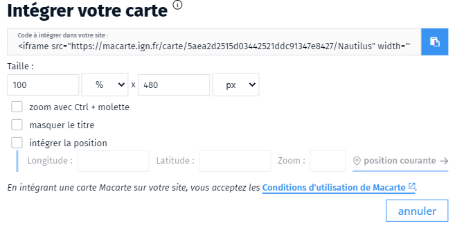

Une fois le réglages réalisé copier le code HTML à intégrer sur votre page web (<i class="fa fa-clipboard"></i>).

1. [Aller plus loins avec le widget carto](macarte/Aller plus loins avec le widget carto)
1. [Comment partager une carte ?](macarte/Comment partager une carte)
1. [Parle-moi de l'Atlas](macarte/Parle-moi de l'atlas)


## macarte/Comment marche l'iFrameAPI
- iframe
- api

L'iFrame-API implémente la fonctionnalité *postMessage* de HTML5 (les navigateurs récents sont compatibles avec *postMessage*) pour faire communiquer la carte et la page appelante.

Concrètement vous avez juste à ajouter le script de l'API sur votre page :

```javascript
<!-- 1. Charger le code de l'API -->
<script type="text/javascript" src="https://macarte.ign.fr/carte/MapIFrameAPI.js"></script>
```

ainsi que l'iFrame correspondant à votre carte :

```javascript
<!-- 2. <iframe> qui va contenir la carte a afficher -->
<iframe id="map" src="https://macarte.ign.fr/carte/MAP_ID/MAP_TITLE" width="100%" height="400"></iframe>
```

Ensuite, dans votre code javascript, il vous suffit d'attendre que l'API soit chargée pour vous en servir :

```javascript
<script>
  // 3. Récupération de l'API lorsque la carte est chargée
  MapIFrameAPI.ready('map', function(api) {
    // Center la carte sur Paris
    api.setCenter([2.33, 48.85]);
    // ou faire autre chose...
  }
</script>
```

[📔 Voir la documentation technique de l'iFrameAPI](https://ignf-ma-carte.github.io/mcviewer/doc/)

1. [Les avantages de l'iFrameAPI](macarte/Aller plus loins avec le widget carto)
1. [Comment intégrer une carte sur mon site ?](macarte/Comment intégrer une carte sur un site)
1. [Comment partager une carte ?](macarte/Comment partager une carte)


## macarte/Comment partager une carte
- macarte
- partage
- url
- iframe
- intégrer

Les cartes sont accessibles directement sur le web au travers d'une adresse (URL), qu'il vous suffit de transmettre (par mail par exemple).
Vous pouvez aussi partager votre carte avec un QR Code lisible sur un Smartphone que vous pourrez intégrer sur une affiche ou un document.
Sur les pages de création de cartes, l'icône <i class="fi-share-alt"></i> dans la barre de menu permet de partager la carte par URL, au travers d'un widget (iFrame) à [intégrer sur un site internet](#macarte/Comment intégrer une carte sur un site) ou sur les réseaux sociaux (X/Twitter, Facebook, LinkedIn).
Vous pouvez ajouter vos cartes dans l'Atlas de Ma carte afin de permettre aux internautes d'y accéder plus facilement.

Vous retrouverez également ces options sur la page de la [carte sur votre compte](https://macarte.ign.fr/mon-compte/#cartes) en cliquant sur le bouton `Détail` de votre carte.


Sur cette page vous trouverez également un lien de partage en édition pour [travailler à plusieurs sur votre carte](#equipe/Comment travailler à plusieurs sur une carte).

Si vous ne souhaitez pas que votre carte puisse être vue par une autre personne que vous, en décochant la case "Carte active" vous serez le seul utilisateur à pouvoir la consulter.

Vous pouvez aussi [créer des équipes](#equipe/Comment travailler en équipe) afin d'avoir un meilleur contrôle sur la manière de partager une carte.

1. [Où trouver le QR Code de partage](macarte/Où trouver le QR Code de partage)
1. [Comment intégrer une carte sur mon site ?](macarte/Comment intégrer une carte sur un site)
2. [Comment travailler à plusieurs sur une carte ?](equipe/Comment travailler à plusieurs sur une carte)
3. [Qui peut voir mes cartes ?](equipe/Qui peut voir mes cartes)
4. [Parle-moi de l'Atlas](macarte/Parle-moi de l'atlas)


## macarte/exemples
- exemple
- demo
- recherche

Le site Ma carte propose un [Atlas](https://macarte.ign.fr/atlas/?mode=gallery) qui répertorie les cartes faites par les utilisateurs du service.

La carte ci-dessous présente le voyage du Nautilus, d'après le roman de Jules Verne, sous forme de carte narrative.

<iframe src="https://macarte.ign.fr/carte/5aea2d2515d03442521ddc91347e8427/Nautilus?noZoom" width="100%" height="480px" allow="geolocation clipboard-read; clipboard-write"></iframe>

[Voir l'atlas de Ma carte](https://macarte.ign.fr/atlas/?mode=gallery)

Des outils de recherche permettent de filtrer les cartes disponibles dans l'Atlas, en particulier :
- la recherche textuelle : un texte libre permet de rechercher une carte par son nom, sa description ou son thème.
- le filtre par thème : pour n'afficher que les cartes d'un thème
- le filtre par auteur : pour afficher les cartes d'un auteur spécifique.
- le filtre par type : pour distinguer les cartes et les cartes narratives.

Ces différents filtres peuvent être combinés pour affiner votre recherche.

1. [Parle-moi de l'Atlas](macarte/Parle-moi de l'atlas)
2. [Qu'est-ce qu'une carte narrative ?](macarte/qu'est ce qu'une carte narrative)
3. [Comment créer une carte en ligne ?](mceditor/créer une carte)


## macarte/historique
- Edugéo
- Édugéo
- historique
- Opensource
- licence

Fruit d'un partenariat entre l'Éducation nationale et l'IGN, le site **Édugéo** propose depuis 2008 aux enseignants de créer des cartes et des projets pédagogiques en ligne.

D'abord réservé aux enseignants, le projet est proposé au grand public en 2015 sous le nom de Ma carte et s'étoffe de nouveaux modules pour localiser des adresses, créer des couches statistiques et raconter des histoires autour d'une carte.
Il est diffusé en Opensource depuis 2023 sur [Github](https://github.com/IGNF-Ma-carte).

1. [Montre-moi des exemples](macarte/exemples)
2. [Comment créer une carte en ligne ?](mceditor/créer une carte)
3. [Localiser une couche d'adresse](mcadresse/Localiser une couche d'adresse)
4. [Créer une couche statistique](mcstat/Comment créer une carte statistique)
5. [Raconter une histoire sur une carte](mcstory/raconter une histoire)


## macarte/licence
- ma carte
- module
- licence
- code

Le code des outils Ma carte est disponible en Opensource sous licence MIT (pour les librairies) et GPL (pour les applicatifs).
Ma carte est référencée sur le [Socle Interministériel des Logiciels Libres](https://code.gouv.fr/sill/detail?name=Ma%20carte).

1. [A qui appartiennent les cartes produites sur Ma carte ?](macarte/A qui appartiennent les cartes produites sur Ma carte)

## macarte/macarte
- macarte
- IGN

Ma carte est un ensemble d'outils en ligne développés par l'Institut national de l'information géographique et forestière (IGN).
Ils permettent de créer et publier des cartes en lignes simplement **depuis un navigateur internet**.

Ma carte est directement accessible dans un navigateur à l'adresse [macarte.ign.fr](https://macarte.ign.fr).
Les cartes produites peuvent être partagées, intégrées dans un blogue ou utilisées dans une communication sur les réseaux sociaux.

1. [En savoir plus sur Ma carte](macarte/historique)
2. [Montre-moi des exemples de cartes](macarte/exemples)
3. [Comment créer une carte](mceditor/créer une carte)
4. [Comment partager une carte](macarte/Comment partager une carte)

## macarte/Ma carte peut-il héberger des images
- image
- galerie

Vous disposez d'un espace personnel pour déposer des images. Il est destiné à simplifier l'utilisation de Ma carte.
Cet espace est limité à 10 Mo. Les utilisateurs désirant utiliser un volume d'images supérieur doivent l'héberger sur un espace tiers.
Les images peuvent être classées dans des galeries. Ceci vous permet de les organiser et d'utiliser le filtrage.

Dans l'application Ma carte le bouton <i class="fi-galerie-image"></i> vous permet d'accéder directement à vos images.

Pour utiliser celles-ci en tant que symbole ponctuel sur une carte ou en Markdown (dans une info-bulle).


Une page est dédiée à vos images dans [votre espace personnel](https://macarte.ign.fr/mon-compte/#medias).

1. [Pourquoi ma carte ne s'imprime pas ?](macarte/Problème pourquoi ma carte ne s'imprime pas)

## macarte/Où trouver le QR Code de partage
- QRCode
- QR code
- partage

Un QR Code (Quick Response Code) est disponible sur la page de visualisation de la carte en cliquant sur le bouton [i] en bas à droite de la carte.
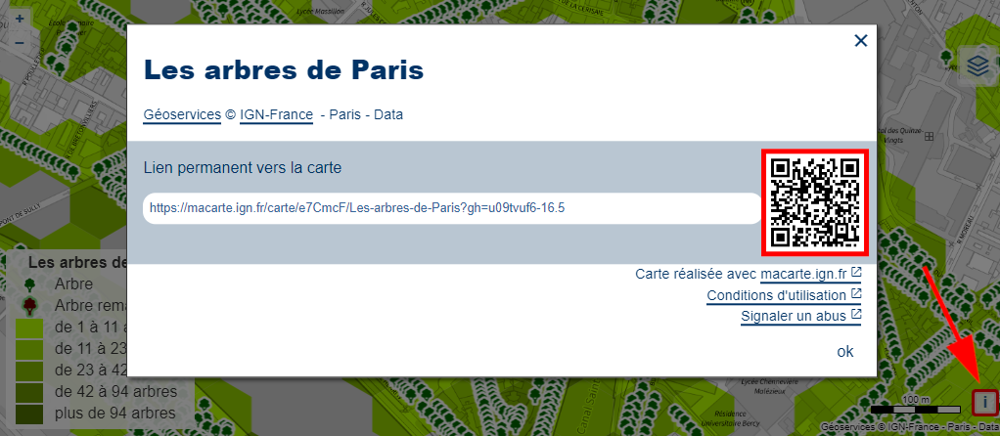

Ce QR Code peut être placé sur une affiche ou un document pour faciliter l'accès à la carte avec un smartphone ou une tablette.

1. [Comment partager une carte ?](macarte/Comment partager une carte)
1. [Comment imprimer une carte ?](macarte/Comment imprimer une carte)

## macarte/Parle-moi de l'atlas
- ma carte
- atlas
- descriptif
- publication
- visibilité
- profil auteur

L'Atlas est un espace de publication de cartes et narrations réalisées avec Ma carte. Les cartes qui y sont exposées sont accessibles à tous les internautes et disponibles en recherche aux visiteurs du site et via les API.

Afin de faciliter la visibilité de vos cartes, il est conseillé de leur donner un titre et une description explicites et de les classer dans le thème adapté. Vous pouvez également lui ajouter une image pour la rendre plus attractive.

C'est vous qui choisissez si vous voulez ou non publier une carte dans l'atlas (à l'enregistrement d'une carte ou dans l'[espace dédié aux cartes](https://macarte.ign.fr/mon-compte/#cartes)).

Un page de l'auteur (profil) accompagne la description des cartes. Il vous est conseillé de le paramétrer de façon à communiquer les informations qui semblent les plus pertinentes. Restez conscient que ce profil sera visible par tous et évitez de divulguer des informations personnelles.
Le paramétrage de votre profil est accessible dans la page [Mes données personnelles](https://macarte.ign.fr/mon-compte/).


1. [A qui appartiennent les cartes produites sur Ma carte ?](macarte/A qui appartiennent les cartes produites sur Ma carte)
2. [Qui peut voir mes cartes ?](equipe/Qui peut voir mes cartes)
2. [Montre-moi des exemples de cartes](macarte/exemples)


## macarte/Problème pourquoi ma carte ne s'imprime pas
- problème
- erreur
- impression

Si vous n'arrivez pas à enregistrer une image de votre carte (une alerte `Impossible d'enregistrer la carte` apparaît), cela vient du fait qu'une image incluse dans la carte interdit ce type d'opération. En effet, dans un navigateur, l'accès aux ressources est restreint si les entêtes de ces ressources ne sont pas correctement remplis (voir CORS).

L'impression via une imprimante fonctionne, mais l'enregistrement est bloqué.


Il peut s'agir d'une image utilisée comme symbolisation sur un point ou d'un service inclus dans un calque (WMS, WMTS, etc.).
Pour débloquer la situation, recherchez le calque qui pose problème (lorsqu'il est masqué, la sauvegarde va fonctionner) et si vous en avez la possibilité de demande au fournisseur d'activer les entêtes CORS.
Pour l'utilisation d'images comme symbolisation sur un objet, vous pouvez demander à Ma carte de l'héberger pour l'utiliser ensuite sans restriction sur vos cartes.

1. [Comment imprimer une carte ?](macarte/Comment imprimer une carte)
1. [Ma carte peut-il héberger des images ?](macarte/Ma carte peut-il héberger des images)

## macarte/Qu'est-ce que le vecteur tuilé
- vecteur tuilé
- tile
- MVT
- PBF

Le tuilage vecteur est un mode de diffusion des données analogue au WMTS (de la tuile "image"), mais qui transmet des objets plutôt que des pixels. Le tuilage vecteur vient apporter de nouvelles possibilités de personnalisation de l'affichage des données.

Les données sont prédécoupées par le serveur et diffusées sous forme de dalles vecteur (tuiles) adaptées à l'échelle de visualisation, ce qui permet à l'utilisateur de ne charger que les données sur la zone concernée, d'avoir des données suffisamment généralisées pour être affichées aux petites échelles et de conserver les dalles calculées dans un cache.

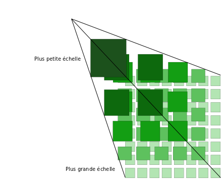

Les avantages apportés par les tuiles vectorielles multiples :
- Rapidité d'accès à la donnée : les données chargées sont adaptées à l'échelle de visualisation et la navigation sur ces données est donc très fluide.
- Facilité de modification du style : les données étant côté client au format vecteur, on peut appliquer un nouveau style sans entraîner un nouveau téléchargement.
- Interaction directe des utilisateurs avec les objets : les données étant servies avec des attributs, on peut y accéder au clic ou changer de style au survol…

Des outils permettent de modifier et d'adapter les styles d'affichage des tuiles en fonction de vos besoins (voir [l'outil proposé sur les tuiles IGN](https://viglino.github.io/ol-ext/examples/layer/map.layer.gppvtile.html?embed=1)).

1. [Comment ajouter des tuiles vectorielles à une carte ?](mceditor/Comment ajouter des tuiles vectorielles)

## macarte/qu'est ce qu'une carte narrative
- carte narrative
- storymap
- narration
- définition

Une carte narrative (ou storymap en anglais) est un récit organisé autour d'une carte.
Par exemple, un récit de voyage par étapes dans lequel la carte se déplace au fur et à mesure de l'avancement du récit pour présenter le voyage au spectateur.
Ce peut être aussi une carte comparative avec, sur la même zone, deux phénomènes ou deux époques différents qu'on veut présenter à l'utilisateur.
L'affichage d'images et de contenu multimédia (photos, vidéos, sons) lorsqu'on clique sur la carte participe également à la narration.

1. [Montre-moi des exemples](macarte/exemples)
2. [Comment créer une histoire autour d'une carte](mcstory/raconter une histoire)


## mcadresse/Comment améliorer le résultat du géocodage
- geocoder
- adresse
- améliorer
- géocodage

Le géocodage dépend fortement de **la façon dont est décrite l'adresse**, une imprécision dans l'adresse, un caractère parasite ou une faute de frappe risque d'induire le géocodage en erreur.

L'adresse fournie peut contenir des éléments perturbant le résultat tel qu'un complément d'adresse (bâtiment, escalier, étage, zone, etc.)
Par exemple *19 rue Jean Baptiste Colbert - ZI des Prés de Lyon 10600 LA CHAPELLE SAINT LUC* ne trouvera pas *ZI des Prés de Lyon* et risque de renvoyer un mauvais résultat.
Pour pallier ce type de problème, il est recommandé d'avoir les éléments informatifs dans une colonne séparée.

Les abréviations peuvent dégrader le résultat du géocodage. 

La localisation sur trois colonnes peut parfois apporter une amélioration grâce à un meilleur filtrage des résultats à la commune.
Veillez également à ce que les colonnes soient bien respectées et qu'il n'y ait pas de décalage dans votre fichier.

Vous pouvez aussi utiliser l'option pour prioriser autour d'un lieu (une adresse ou une commune) pour limiter la recherche dans une zone géographique et éviter des résultats trop éloignés de votre zone de recherche. 

1. [Quels sont les limites du géocodage ?](mcadresse/les limites du géocodage)
2. [Quels sont les formats de fichier pour le géocodage ?](mcadresse/les fichiers pour le géocodage)
3. [Comment corriger une erreur de géocodage ?](mcadresse/Comment corriger une erreur de géocodage)


## mcadresse/Comment corriger une erreur de géocodage
- géocoder
- adresse
- erreur
- corriger
- correction
- géocodage

Si une adresse est mal positionnée, l'outil propose généralement des adresses alternatives dans le panneau de gauche. 
Ce sont des adresses ressemblant à celles proposées (mais avec un score inférieur). Vous pouvez alors choisir dans la liste proposée.

Si cela ne suffit pas, lorsqu'un point est sélectionné, deux options s'offrent à vous dans le panneau de gauche : 
- Modifier l'adresse que vous propose de corriger l'adresse et de relancer un géocodage.
- Déplacer manuellement un point qui vous permet de bouger le point sur la carte. Une fois le déplacement validé, l'outil recalcule un géocodage sur cette nouvelle position
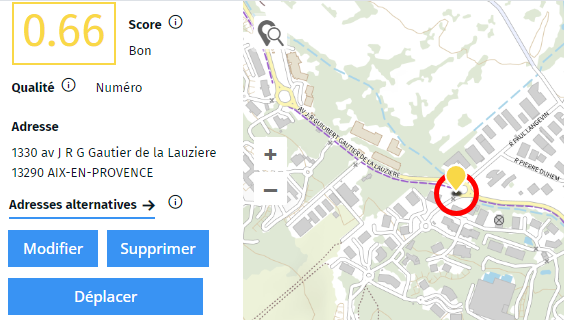

1. [Qu'est-ce que le score de géocodage ?](mcadresse/Qu'est-ce que le score de géocodage)
1. [Qu'est-ce que l'indice de qualité du géocodage ?](mcadresse/Qu'est-ce que l'indice de qualité du géocodage)

## mcadresse/Comment formater un fichier pour le géocoder
- formater
- formatage
- adresse
- csv
- table
- colonne

Les colonnes utilisées pour le géocodage doivent être organisées de façon à pouvoir retrouver l'adresse :
- soit dans une seule colonne contenant l'ensemble des informations rue, code postal et commune
- soit en trois colonnes contenant séparément la rue, le code postal et la commune
- soit une colonne avec l'identifiant IDU de la parcelle

💡 Une colonne contenant le nom de l'entité sera utilisée pour la différencier des autres sur la carte.
Il est recommandé d'avoir une ligne de titre pour identifier facilement les colonnes mais ce n'est pas obligatoire

Par exemple : 
| Nom | Adresse |
|-----|------|
| IGN | 73 avenue de paris 94160 Saint-Mandé |

| Nom | Rue | Code postal | Commune |
|-----|-----|-----|-----|
| IGN | 73 avenue de paris | 94160 |Saint-Mandé |

| Nom | IDU |
|-----|------|
| K0214 | 940420000K0214 |

📝 la présence de colonnes supplémentaires non utilisées pour le géocodage ne perturbe pas l'application. Elles seront conservées dans un export du résultat.

1. [Quels sont les formats de fichier pour le géocodage ?](mcadresse/les fichiers pour le géocodage)
2. [Quels sont les limites du géocodage ?](mcadresse/les limites du géocodage)


## mcadresse/Comment géocoder un fichier d'adresses
- géocoder
- géocodage
- fichier
- csv

Pour que le géocodage réussisse, vos données doivent être organisées de façon à rendre la recherche possible.

1. Une adresse correspond à une ligne du fichier
2. Les informations doivent être organisées de la même façon pour chaque ligne
3. Il est recommandé d'avoir une ligne de titre pour identifier facilement les colonnes mais ce n'est pas obligatoire
4. Il est possible d'ignorer des lignes dont la première colonne commence par un texte déterminé mais ce n'est pas obligatoire
5. Il est possible de sélectionner une plage de ligne à traiter mais ce n'est pas obligatoire

Le fichier doit contenir une adresse dans une colonne ou dans 3 colonnes (rue, code postal et commune) ou un identifiant de parcelle qui permette de retrouver la localisation de la ligne.


1. [Comment géocoder à la parcelle ?](Comment_géocoder_à_la_parcelle.md)
1. [Quels sont les formats de fichier ?](mcadresse/les fichiers pour le géocodage)
2. [Comment formater un fichier pour le géocoder ?](mcadresse/Comment formater un fichier pour le géocoder)

## mcadresse/Comment géocoder à la parcelle
- géocoder
- parcelle

Pour procéder à à un géocodage à la parcelle vous devez fournir au système des codes parcelles.
Le code parcelle est formé de 14 caractères comme suit :
- le code INSEE de la commune sur 5 caractères. Pour les communes à arrondissements (Paris, Lyon et Marseille), il faut préciser le code de l'arrondissement et pas le code INSEE de la commune agrégée.
- le préfixe de la parcelle. la plupart du temps il correspond à 000. Dans le cas d'une commune associée (Lomme et Hellemmes à Lille par exemple) ou dans les cas des communes à arrondissement, il s'agit de trois chiffres.
- le code de section cadastrale sur 2 caractères : soit 2 lettres majuscules si la section est sur 2 lettres, soit un zéro et la lettre de la section en majuscules
- le code de la parcelle sur 4 caractères : La parcelle n°1 est encodée 0001, la parcelle n°10 donne 0010, la parcelle n°100 donne 0100

Par exemple une des parcelles où se situe le pôle Géosciences, siège de l'IGN sera encodée : 940670000D0050.

Dans ce mode, vous pouvez récupérer non seulement le point mais aussi la géométrie de la parcelle (polygone) si cette option est cochée dans les informations supplémentaires.

1. [Quels sont les formats de fichier ?](mcadresse/les fichiers pour le géocodage)
2. [Comment formater un fichier pour le géocoder ?](mcadresse/Comment formater un fichier pour le géocoder)

## mcadresse/les fichiers pour le géocodage
- adresse
- géocodage
- géocoder
- csv
- xls
- tabulation

Le fichier doit être tabulé dans un format reconnu de l'application : **Excel**, **Calc** ou **csv**.

Pour les fichiers au format Excel ou Calc, il est recommandé de n'avoir qu'une seule feuille dans le fichier. S'il y en a plusieurs, c'est la première qui sera utilisée

Pour les fichiers **csv**, il est possible d'avoir une tabulation personnalisée.

1. [Comment géocoder un fichier d'adresses avec Ma carte ?](mcadresse/Comment géocoder un fichier d'adresses)
2. [Comment formater un fichier pour le géocoder ?](mcadresse/Comment formater un fichier pour le géocoder)


## mcadresse/les limites du géocodage
- limite
- restriction
- adresses
- étranger
- géocodage

Les adresses ne peuvent être localisées que sur le **territoire français** à l'exclusion de tout territoire étranger.
Certains territoires ne sont pas couverts par les données de référence :
- La BD TOPO® et le PCI ne couvrent pas la Polynésie Française, Wallis-et-Futuna, la Nouvelle-Calédonie et Clipperton.
- Le PCI ne couvre pas Saint-Pierre-et-Miquelon.
- La BAN couvre l’ensemble des départements français ainsi que les collectivités d’Outre-Mer (Saint-Barthélemy, Saint-Martin, Saint-Pierre-et-Miquelon, Wallis-et-Futuna, Polynésie Française) et d’autres territoires (Nouvelle-Calédonie et Clipperton).

Le géocodage dépend fortement de **la façon dont est décrite l'adresse**, une imprécision dans l'adresse, un caractère parasite ou une faute de frappe risque d'induire le géocodage en erreur.

Enfin, l'application a des limites techniques, il est déconseillé de traiter un fichier de plus de 25000 adresses. Cette limite dépend aussi de votre ordinateur. Dans ce cas, il est conseillé de découper votre fichier en plusieurs lots plus petits.

1. [Qu'est-ce que le géocodage ?](mcadresse/Localiser une couche d'adresse)
1. [Comment géocoder un fichier d'adresses avec Ma carte ?](mcadresse/Comment géocoder un fichier d'adresses)
2. [Comment améliorer le résultat du géocodage ?](mcadresse/Comment améliorer le résultat du géocodage)

## mcadresse/Localiser une couche d'adresse
- géolocaliser
- adresse
- géocodage
- géocoder
- geocoder
- geocode
- qu'est-ce

Le processus qui permet de localiser une adresse s'appelle le **géocodage**.   
Le géocodage est un procédé qui permet de retrouver à partir d'une adresse littérale sa position sur la terre et ainsi l'afficher sur une carte.
Par exemple, '*73 avenue de Paris, 94160 SAINT-MANDÉ*' est situé à 48,845726 de latitude Nord et 2,424573 de longitude Est.
Le géocodage peut se faire à partir d'une adresse, de lieu-dit, une unité administrative, un point d'intérêt ou d'une parcelle cadastrale.

1. [Comment géocoder un fichier d'adresses avec Ma carte ?](mcadresse/Comment géocoder un fichier d'adresses)
2. [Que renvoie le géocodage ?](mcadresse/Que renvoie le géocodage)
3. [Quels sont les limites du géocodage ?](mcadresse/les limites du géocodage)
4. [Comment améliorer le géocodage ?](mcadresse/Comment améliorer le résultat du géocodage)


## mcadresse/Qu'est-ce que l'indice de qualité du géocodage
- geocodage
- qualité
- indice

L'indice de qualité indique le type d'objet trouvé par le géocodeur.

- **Parcelle** : placé par numéro de parcelle
- **Point d'intérêt** :	placé sur un point d'intérêt
- **Département** :	placé au centre du département
- **Ville**	: placé au centre d'une commune
- **Rue**	: placé au milieu d'une rue
- **Numéro** : placé au numéro d'adresse
- **Manuel** : déplacé manuellement

⚠️ l'indice de qualité influe fortement sur le score de géocodage.
Ainsi une adresse placée à la rue aura une moins bonne position qu'une adresse placée au numéro même si son score est plus faible.

1. [Qu'est-ce que le score de géocodage ?](mcadresse/Qu'est-ce que le score de géocodage)
2. [Quels sont les limites du géocodage ?](mcadresse/les limites du géocodage)


## mcadresse/Qu'est-ce que le score de géocodage
- score
- géocodage

Le score de géocodage qui caractérise la qualité de la localisation, est un nombre compris entre 1 (correspondance exacte) et 0 (pas de correspondance trouvée). 
Plus le score est élevé, plus le résultat fourni est statistiquement fiable. Il tient compte d'une valeur lexicale (correspondance avec les mots dans l'adresse), la proximité avec la commune trouvée ou avec la proximité d'un lieu si l'option a été choisie.

⚠️ Le score doit toujours s'interpréter en fonction de l'indice de qualité. 
Ainsi un score de 1 avec une qualité "rue" est moins précis qu'un score moindre avec une qualité "numéro".
Dans le premier cas, l'outil a bien trouvé la rue mais pas le numéro et a positionné l'adresse au milieu de la rue.

1. [Qu'est-ce que l'indice de qualité du géocodage ?](mcadresse/Qu'est-ce que l'indice de qualité du géocodage)
2. [Quels sont les limites du géocodage ?](mcadresse/les limites du géocodage)


## mcadresse/Que renvoie le géocodage
- géocodage
- csv
- résultat

En plus de la localisation géographique **latitude** et **longitude**, l'application fournit :
- une **adresse** géocodée qui permet de vérifier à quel élément de la base de référence correspondent les coordonnées calculées
- une **qualité** qui caractérise la donnée source utilisée pour le point géocodé
- un **score** de géocodage compris entre 0 et 1
- des **adresses alternatives** (lorsqu'il en trouve)
- l'**altitude** du point (lorsque l'option a été choisie)

Le résultat du géocodage peut être enregistré dans un fichier tableur (csv, xlsx) ou géographique (kml, geojson).
Il peut également être enregistré dans une carte pour être repris dans les autres outils de Ma carte.

1. [Quels sont les outils de Ma carte ?](macarte/macarte)

## mceditor/Afficher les clusters statistiques
- cluster
- clusters
- statistique

Le mode cluster statistique permet de regrouper les objets et de les afficher sous forme de graphique en anneau (donuts), dont les couleurs dépendent des couleurs des objets inclus dans le cluster.

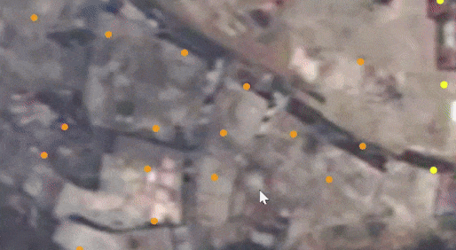

Les couleurs utilisées sont :
* la couleur du symbole, pour un point en mode symbole ;
* la couleur de la forme pour un point en mode image. Si aucune forme n'est indiquée, une couleur gris clair est utilisée ;
* la couleur de l'étiquette en mode étiquette
* pour les lignes et polygones, c'est la couleur du contour qui est utilisée.

📌 Les objets non représentés sur la carte (sans style) ne seront pas inclus dans les clusters statistique (contrairement aux autres type de clusters).

1. [Qu'est-ce que le mode cluster ?](mceditor/Qu'est-ce que le mode cluster)
1. [Comment voir ce que contient un cluster](mceditor/Comment voir ce que contient un cluster)


## mceditor/Ajouter un filtre à une couche
- couche
- layer
- calque
- filtre
- gris

Vous pouvez ajouter un filtre à une carte pour le passer en niveau de gris.

💡 Les fonds peuvent aider à localiser le phénomène à cartographier, mais ils peuvent aussi venir brouiller le message qu'on veut passer. S'il est trop coloré, le fond interfère avec l'information qu'on va ajouter par-dessus et, dans certains cas, il sera nécessaire de l'atténuer ou de le passer en niveau de gris pour éviter la confusion.


1. [Le gestionnaire de couche](mceditor/Parle-moi du gestionnaire de couche)
1. [Explique-moi les modes de fusion](mceditor/Explique moi les modes de fusion)

## mceditor/A quoi sert la thématique d'une couche
- thématique
- gestionnaire
- couche
- layer
- calque
- logo

Vous pouvez ajouter une thématique aux couches de la carte dans les paramètres (étendus) du calque.
Pour certaines opérations, les couches seront regroupées sous ces thématiques.

Par exemple dans le **gestionnaire thématique**, dans une carte narrative, n'affiche que les couches visibles à l'ouverture et propose à l'utilisateur d'ajouter les autres couches à la demande. Cette option est particulièrement pratique si la carte propose un grand nombre de couches pour ne pas surcharger la liste des couches disponibles.

1. [Quelles sont les propriétés d'une couche ?](mceditor/Quelles sont les propriétés d'une couche)


## mceditor/comment afficher un fichier distant dans Ma carte
- ajouter
- couche
- layer
- calque
- url
- kml
- geojson
- fichier
- distant

Il est possible de connecter un fichier distant (hébergé sur un autre serveur) à une couche Ma carte.
Pour cela, dans la fenêtre d'ajout de fonds cartographiques (accessible via le gestionnaire de couches <i class="fg-layer-alt-add-o"></i>)

Dans le dialogue, choisissez `Depuis un fichier` puis `Fichier distant...`.
Entrez l'url du fichier pour vous connecter dessus.
⚠️ Attention, le fichier doit être accessible en https et les entêtes [CORS](https://fr.wikipedia.org/wiki/Cross-origin_resource_sharing) doivent être remplies pour permettre d'accéder aux données. Si le fichier n'est pas accessible aucune donnée ne sera chargée.

L'avantage de lier un fichier externe et qu'il est parfois plus facile de mettre à jour ce fichier. A chaque nouvel affichage de la carte le fichier va être rechargé et les nouvelles données affichées. Ce peut être pratique pour certains usages (données en temps réel, mise à jour automatique, etc.).

Par contre vous n'aurez pas accès aux données directement pour les symboliser et vous devrez [utiliser une symbolisation paramétrique](#symboliser/Qu'est-ce qu'une représentation paramétrique) pour les représenter sur la carte.

1. [Comment ajouter des données à un calque ?](mceditor/Comment ajouter des données à un calque)
1. [Qu'est-ce qu'une représentation paramétrique ?](symboliser/Qu'est-ce qu'une représentation paramétrique)
2. [Comment créer une bibliothèque de symboles ?](mceditor/Comment créer une bibliothèque de symboles)


## mceditor/Comment ajouter des attributs à un objet
- attribut
- attributs
- objet
- paramètre
- propriété
- information descriptive

L'information géographique est la représentation d'un objet ou d'un phénomène dans l'espace.
Afin de décrire les propriétés des objets, on leur adjoint des attributs. Ainsi, lorsque vous aurez [saisi un nouvel objet](#mceditor/Comment saisir des objets dans Ma carte) ou lorsque vous [sélectionnez un objet](#selection/Comment sélectionner des objets) vous pouvez consulter, modifier ou ajouter des attributs dans l'onglet `Attributs` <i class="fi-tag colored"></i>.

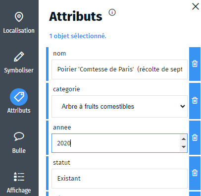

Les attributs d'une couche peuvent [être personnalisés](#mceditor/Comment personnaliser les attributs d'une couche vecteur) afin de faciliter leur saisie et d'assurer la cohérence sur la couche.
Il est possible d'afficher les attributs d'un objet sous forme d'[étiquettes sur la carte](#symboliser/Comment mettre en forme une étiquette sur la carte) ou dans l'[info-bulle de l'objet sélectionné](#md/Afficher des attributs en Markdown).
Enfin, les attributs peuvent servir à représenter les objets à l'aide d'une [symbolisation paramétrique](#symboliser/Qu'est-ce qu'une représentation paramétrique).

1. [Comment personnaliser les attributs d'une couche ?](mceditor/Comment personnaliser les attributs d'une couche vecteur)
1. [Qu'est-ce qu'une représentation paramétrique ?](symboliser/Qu'est-ce qu'une représentation paramétrique)
1. [Comment afficher les attributs d'un objet en Markdown ?](md/Afficher des attributs en Markdown)


## mceditor/Comment ajouter des données à un calque
- calque
- couche
- layer
- ajouter
- upload
- données
- geojson
- kml

Vous pouvez ajouter des données à un calque de dessin depuis un fichier format GeoJSON ou KML.
Pour cela, sélectionnez le calque qui contient les données dans le gestionnaire de couche (passe en surbrillance bleue) puis ouvrez la fenêtre d'options en cliquant sur le bouton <i class="fg-layer-alt-add-o"></i> en bas à droite du gestionnaire.
Dans la fenêtre d'options de la couche, cliquez sur le bouton de chargement <i class="fi-open"></i>.
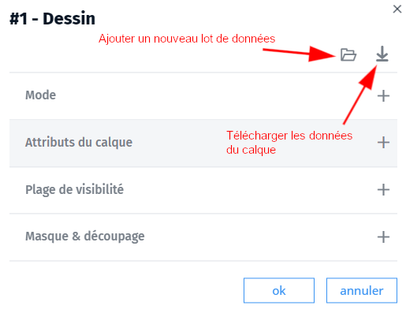

💡 Si vous utilisez une [définition de styles paramétrique](#symboliser/Qu'est-ce qu'une représentation paramétrique) dans le calque, les objets ajoutés sont symbolisés directement.

> ⚠️ L'import de données vectorielles doit se faire en degrés décimaux (WGS84, code EPSG:4326) ou en Web Mercator (EPSG:3857). Pour utiliser des données exprimées dans une autres projection une conversion en amont est nécessaire.

1. [Comment saisir des données dans un calque ?](mceditor/Comment saisir des objets dans Ma carte)
1. [Comment utiliser une symbolisation paramétrique ?](symboliser/Qu'est-ce qu'une représentation paramétrique)
1. [Comment enregistrer les données d'un calque ?](mceditor/Comment enregistrer les données d'un calque)
1. [Quels sont les référentiels géographiques utilisés par Ma carte ?](mceditor/Quels sont les référentiels géographiques utilisés par Ma carte)
1. [Comment ajouter un calque sur une carte ?](mceditor/Quels sont les fonds disponibles dans Ma carte)

## mceditor/Comment ajouter des flux OGC
- fonds
- flux
- OGC
- fichier
- ajouter
- shape
- shp
- gpkg

Ma carte permet de brancher des flux définis par l'Open Geospatial Consortium (**OGC**) pour les ajouter sous forme de couche sur Ma carte.


Vous pouvez ainsi ajouter vos propres couches via des flux **WMTS, WMS, XYZ, WFS ou geoRSS**.

Si vous avez des fichiers de données géographiques (aux formats **KML, GeoJSON, GPX ou GeoCSV**) vous pouvez les importer dans une couche, via le dialogue ou par glisser/déposer. 
Si le fichier est disponible sur internet, vous pouvez le lier via une url dans une couche.

1. [Montre-moi comment afficher un fichier distant dans Ma carte](mceditor/comment afficher un fichier distant dans Ma carte)
1. [Comment ajouter des données à un calque](mceditor/Comment ajouter des données à un calque)
2. [Quels sont les fonds disponibles dans Ma carte ?](mceditor/Quels sont les fonds disponibles dans Ma carte)


## mceditor/Comment ajouter des fonds Géoportail
- geoportail
- géoportail
- géoplateforme
- fonds
- couche
- flux
- WMTS


Vous pouvez ajouter facilement des fonds Géoportail via l'interface d'ajout de couche (en mode simplifié)
Il vous suffit de cliquer sur l'icône `Géoportail`.


Dans la fenêtre qui s'ouvre, vous pouvez rechercher parmi les nombreuses couches disponibles, classées par thématiques :


1. [Quels sont les fonds disponibles dans Ma carte ?](mceditor/Quels sont les fonds disponibles dans Ma carte)
2. [Ajouter des flux OGC](mceditor/Comment ajouter des flux OGC)
3. [Ajouter des tuiles vectorielles](mceditor/Comment ajouter des tuiles vectorielles)

## mceditor/Comment ajouter des tuiles vectorielles
- couche
- layer
- calque
- tuiles
- vecteur tuilé
- tuile vecteur
- tuiles vectorielles
- MVT
- TMS
- PBF
- tuilé

Vous pouvez ajouter une couche vecteur tuilé (MVT) via le gestionnaire de couches <i class="fg-layer-alt-add-o"></i>, puis dans l'onglet tuiles vectorielles du dialogue.


Vous pouvez alors choisir un des flux proposés par le Géoportail ou vous brancher sur un autre flux vecteur tuilé. Dans ce cas, vous devez renseigner l'adresse du flux, soit via un fichier de style (.json) fourni par le service, soit directement sur les données (.pbf).

Vous pouvez également fournir un fichier style local (attention cependant les données du flux devront être disponibles en ligne), ceci peut être intéressant pour personnaliser un flux existant (par exemple un flux IGN en utilisant [l'outil proposé](https://viglino.github.io/ol-ext/examples/layer/map.layer.gppvtile.html?embed=1))

1. [Qu'est-ce que le vecteur tuilé ?](macarte/Qu'est-ce que le vecteur tuilé)
1. [Comment ajouter des flux OGC ?](mceditor/Comment ajouter des flux OGC)


## mceditor/Comment ajouter une légende à une couche
- légende
- legende
- couche
- calque
- layer

Il est possible d'ajouter une légende aux couches dans le gestionnaire de couche de l'outil de création de cartes <i class="fg-map-legend"></i>.
Vous pouvez créer une légende à partir d'une image existante ou de toute pièces (mode manuel) avec les symboles disponibles dans la bibliothèque de symboles.
Si la couche est un WMS qui a une légende (image) indiquée dans le flux, vous pouvez demander à utiliser celle-ci. 

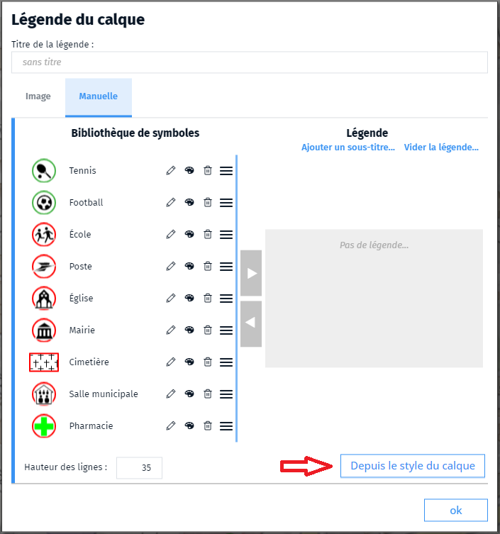

💡 Si vous utilisez des styles paramétrique dans le calque, en cliquant sur le bouton `Depuis le style` du calque tous les styles paramétrés sont automatiquement insérés dans la légende du calque avec leur nom.

📝 la légende du calque n'est pas automatiquement intégrée dans la légende de la carte. 
Pour cela vous devez l'ajouter à la légende de la carte via le menu <i class="fg-map-legend colored"></i> `Affichage`. 
💡 la légende ne s'affiche pas si la couche est masquée.


1. [Montre-moi une vidéo](mceditor/video layer legend)
1. [Comment ajouter une légende à ma carte ?](mceditor/Comment créer une légende)
1. [Comment créer une bibliothèque de symboles ?](symboliser/Comment créer une bibliothèque de symboles)
1. [Qu'est-ce qu'une représentation paramétrique ?](symboliser/Qu'est-ce qu'une représentation paramétrique)


## mceditor/Comment améliorer l'affichage d'une carte
- optimiser
- améliorer
- affichage
- carte
- cluster
- clusters
- affichage image
- mode image

La lenteur d'affichage peut avoir plusieurs origines dont certaines ne dépendent pas de l'application Ma carte : surcharge du réseau, serveur de données surchargé, terminal déficient.
Cependant, les données vecteur que vous chargez peuvent conduire à des ralentissements voire un blocage total. Il n'y a pas de limite théorique mais la pratique conduit à déconseiller les fichiers de plus de **50 Mo**.
Lorsque vous chargez un fichier volumineux, il est fortement conseillé de paramétrer **son mode de visualisation**, accessible via le bouton de configuration du calque <i class="fi-configuration"></i> en bas du gestionnaire de couche.

Les modes conseillés sont :
- **cluster** qui regroupe les objets en un seul selon des paramètres personnalisables de proximité et de zoom. En plus d'accélérer l'affichage, la lisibilité de votre carte est meilleure.
- **image** qui va fluidifier l'affichage (sans recalculer l'image de la carte lors des déplacements).


📝 L'inconvénient de ce mode est que l'affichage ne va pas suivre la rotation de la carte.
Aussi, si vous avez des étiquettes ou des symboles qui s'affichent sur cette couche ils vont se retrouver penchés, ce qui peut nuire à la lisibilité.

Vous pouvez également limiter les plages de zooms dans lesquels le calque va s'afficher.
Généralement, lorsque vous avez beaucoup de données, à petit zoom elles viennent se superposer et rendent la carte illisible. Il est alors conseillé de ne pas les afficher à partir d'un certain zoom. Il est possible par contre d'afficher une couche allégée, plus synthétique, qui représentera le phénomène observé à cette échelle qui s'affichera aux niveaux de zoom pour lesquels la couche est masquée.

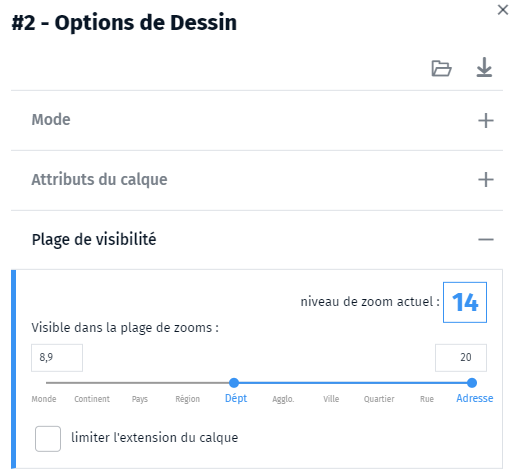

L'utilisation de flux tuilés est aussi recommandée : WMTS plutôt WMS et tuiles vectorielles plutôt que WFS.

Pour les statistiques impliquant de nombreux îlots IRIS, communes ou EPCI, il faut choisir la version du maillage "allégé" à la création de la statistique.

1. [Qu'est-ce que le mode cluster ?](mceditor/Qu'est-ce que le mode cluster)
1. [Comment optimiser une carte statistique ?](mcstat/Comment optimiser une carte statistique)


## mceditor/Comment créer une légende
- légende
- legende
- créer
- création
- ajouter

Il est conseillé d'ajouter une légende à vos cartes afin d'en faciliter l'interprétation.
La légende est accessible dans l'onglet `Affichage` <i class="fg-map-legend colored"></i>.

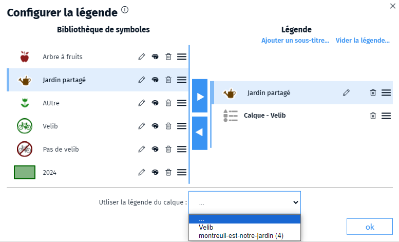

Vous devez au préalable avoir [ajouté des symboles dans la bibliothèque](#symboliser/Comment créer une bibliothèque de symboles) de symbole de la carte. Ce sont ces symboles qui seront utilisés dans la légende. Sélectionnez un symbole dans la bibliothèque puis cliquez sur la flèche bleue pour l'ajouter à la légende.
Si vous avez associé une légende à une couche vous pouvez l'ajouter via le menu disponible en bas du dialogue. Dans ce cas la légende du  calque ne s'affichera que si le calque est visible.

Vous pouvez ajouter des lignes de titre et ordonner les lignes de la légende à votre guise.
La légende va affiche (si l'option est cochée) en bas à droite de votre carte.

1. [Montre-moi une vidéo](mceditor/video legende)
1. [Comment ajouter des symboles à une bibliothèque ?](symboliser/Comment créer une bibliothèque de symboles)
1. [Comment ajouter une légende à une couche ?](mceditor/Comment ajouter une légende à une couche)
1. [Qu'est-ce qu'une représentation paramétrique ?](symboliser/Qu'est-ce qu'une représentation paramétrique)


## mceditor/Comment créer un masque de découpage
- masque
- découpage
- layer
- couche
- calque

L'option de découpe d'un calque permet de n'afficher le calque qu'à l'intérieur du masque. Vous pouvez utiliser une couleur de masque qui s'affichera à l'extérieur. En jouant sur l'opacité de cette couleur, vous pouvez afficher plus ou moins le contenu du calque à l'extérieur.
Vous pouvez également ajouter un léger ombrage au masque.

Pour spécifier un masque, vous devez au préalable sélectionner un objet surfacique dans une couche vecteur qui servira de découpe (cliquez sur le bouton `Utiliser la sélection` dans le dialogue d'options du calque).

1. [Montre moi une vidéo](mceditor/video masque de découpage)
1. [Quelles sont les propriétés d'une couche ?](mceditor/Quelles sont les propriétés d'une couche)


## mceditor/Comment enregistrer les données d'un calque
- calque
- couche
- layer
- exporter
- enregistrer
- download
- télécharger
- données
- geojson
- kml

Vous avez la possibilité de récupérer les données saisies dans l'outil d'édition de cartes au format GeoJSON ou KML
Pour cela, sélectionnez le calque qui contient les données dans le gestionnaire de couche (passe en surbrillance bleue) puis ouvrez la fenêtre d'options en cliquant sur le bouton <i class="fi-configuration"></i> en bas à droite du gestionnaire.
Dans la fenêtre d'options de la couche, cliquez sur le bouton de téléchargement <i class="fi-download"></i>.


⚠️ L'export se fait en coordonnées géographiques décimales (WGS84, code EPSG:4326)

1. [Comment sauvegarder une carte ?](mceditor/Comment puis-je sauvegarder une carte)
1. [Comment ajouter des données à un calque ?](mceditor/Comment ajouter des données à un calque)
1. [Quels sont les référentiels géographiques utilisés par Ma carte ?](mceditor/Quels sont les référentiels géographiques utilisés par Ma carte)


## mceditor/Comment importer une couche d'une autre carte
- importer
- couche
- calque
- layer
- dans une carte
- dans ma carte

Vous pouvez importer une couche depuis une carte existante dans votre carte.
Pour cela, rendez-vous dans le gestionnaire de couches et cliquez sur le bouton d'ajout <i class="fg-layer-alt-add-o"></i> dans la barre inférieure, puis cliquer sur `Depuis une autre carte...`. Sélectionnez ensuite la carte dans la liste proposée.
Dans le dialogue qui s'ouvre cocher la couche que vous voulez importer.
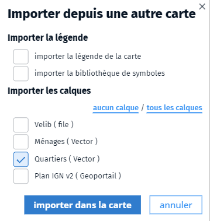

1. [Comment créer une carte en ligne ?](mceditor/créer une carte)


## mceditor/Comment mettre à jour les données d'un calque de dessin
- mettre à jour
- mise à jour
- couche
- layer
- data
- dessin

Dans le module d'édition, il est possible de remplacer ou ajouter des données dans un calque de dessin en chargeant un nouveau lot de données dans le dialogue d'options du calque via le gestionnaire de calque <i class="fi-configuration"></i>.


Les nouvelles données vont venir se charger dans le calque. 
💡 Vous pouvez choisir de remplacer les données existantes en cochant l'option dans le dialogue.

Si le calque a un style paramétrique, celui-ci s'appliquera automatiquement aux nouvelles données.

1. [Qu'est-ce qu'une représentation paramétrique ?](symboliser/Qu'est-ce qu'une représentation paramétrique)


## mceditor/Comment paramétrer l'info-bulle d'un objet
- bulle
- info-bulle
- object
- sélection
- selection

Lorsqu'on clique sur un objet de la carte, une bulle d'information va s'afficher.
Vous pouvez paramétrer cette bulle à l'aide de Markdown dans l'onglet `Bulle`.

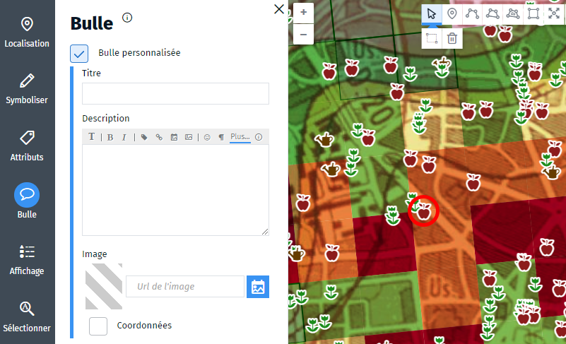

Vous pouvez renseigner un titre, une description (en Markdown) et une image. Vous pouvez aussi choisir d'afficher les coordonnées de l'objet (ceci est surtout valable pour un point car sinon, c'est la position du premier point qui est utilisé).

💡 Le titre et l'image sont de simples aides pour la saisie mais vous pouvez les intégrer directement dans le Markdown pour plus de souplesse dans le rendu. De la même manière la balise MD `%COORD%` (coordonnées) et `%COORDMS%` (coordonnées en degrés, minutes, secondes).

⚙️ Si la bulle n'est pas renseignée sur l'objet, c'est la bulle du calque qui sera utilisée.

1. [Qu'est-ce que l'info-bulle d'une couche ?](mceditor/Qu'est-ce que l'info-bulle d'une couche)
1. [Comment afficher une image dans une info-bulle ?](md/Intégrer des médias dans Ma carte)
1. [Qu'est-ce que le Markdown ?](md/markdown)


## mceditor/Comment personnaliser les attributs d'une couche vecteur
- couche
- layer
- calque
- attribut
- attributs
- propriétés
- vecteur
- objets
- case à cocher
- liste
- type

Vous pouvez personnaliser les attributs d'une couche de dessin dans le dialogue des options du calque.
Une fois les attributs configurés, à chaque fois qu'un objet sera ajouté à la couche, l'outil lui affectera les attributs donnés avec la valeur par défaut fournie.
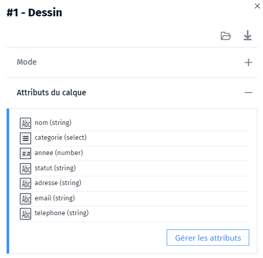

Vous pouvez typer les attributs afin d'aider à la saisie. Un attribut peut être de type chaîne de caractères (1 seule ligne) ou une zone de texte (multi-ligne), un nombre (entier ou décimal) une case à cocher ou une liste de valeur (qui s'affichera dans un menu).


1. [Qu'est-ce qu'une couche vecteur ?](mceditor/Qu'est-ce qu'une couche vecteur)
1. [Modifier les attributs d'un objet](mceditor/Comment ajouter des attributs à un objet)

## mceditor/Comment puis-je sauvegarder une carte
- enregistrer
- sauvegarder
- carte
- modèle

Chaque utilisateur disposant d'un compte peut enregistrer ses cartes dans son espace personnel via l'icône <i class="fi-save"></i> située dans le bandeau en haut à droite.
 C'est la façon la plus simple et recommandée d'enregistrer une carte.

Il est également possible d'enregistrer une copie de la carte sur son ordinateur (format `.carte`). Ce format est interne à l'application Ma carte et vous pourrez l'ouvrir par glisser/déposer dans une fenêtre de l'[éditeur](https://macarte.ign.fr/edition/carte/).

Pour enregistrer un fichier `.carte`, cliquez sur l'icône <i class="fi-download"></i> située dans le bandeau en haut à droite.

Il est intéressant d'utiliser cette possibilité pour transmettre votre carte en tant que modèle. Le destinataire pourra alors la charger dans l'application Ma carte et la modifier à sa guise.
Cette option vous permet d'utiliser Ma carte sans créer de compte ou laisser les données de votre carte sur internet.

1. [Comment enregistrer les données d'un calque ?](mceditor/Comment enregistrer les données d'un calque)
1. [Peut-on enregistrer une image de la carte ?](macarte/Comment imprimer une carte)

## mceditor/Comment saisir des objets dans Ma carte
- dessin
- couche
- saisie
- saisir

Une couche de dessin est une couche sur laquelle on va pouvoir accéder, modifier et ajouter de nouveaux objets à travers l'[outil de création de cartes](https://macarte.ign.fr/edition/carte).
Vous pouvez avoir autant de couche de dessin que vous voulez (via le gestionnaire de couches <i class="fg-layer-alt-add-o"></i>)

La saisie de nouvelles données se fait à l'aide des outils de dessin en haut de l'écran.
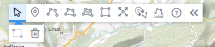

Cliquez sur le <i class="fi-help"></i> pour accéder à une aide complète.

La saisie se fait dans la couche active (surlignée en bleu dans le gestionnaire de couche).

Vous pouvez saisir des points, des lignes ou des surfaces ainsi que des trous dans les surfaces.
Des options vous permettent également de vous accrocher aux objets existants ou d'afficher une mesure lors de la saisie.

1. [Quels sont les raccourcis claviers ?](mceditor/Quels sont les raccourcis claviers de dessin)
1. [Comment symboliser un objet ?](symboliser/Comment symboliser un objet)
1. [Parle-moi du gestionnaire de couche](mceditor/Parle-moi du gestionnaire de couche)


## mceditor/Comment voir ce que contient un cluster
- cluster
- bulle
- popup

**En mode visualisation** deux actions sont disponibles au clic sur un cluster : soit la carte zoom sur les éléments du cluster, soit on affiche une info-bulle pour naviguer dans le cluster.

💡 si le cluster n'a qu'un seul élément, c'est dans tous les cas la bulle qui s'affiche (s'il y en a une).

<i class="fi-configuration fa-fw"></i> Le choix se fait dans la fenêtre de configuration du calque du gestionnaire de calque.
Il est nécessaire de [paramétrer les bulles des objets](#mceditor/Comment paramétrer l'info-bulle d'un objet) ou l'[affichage des info-bulles du calque](#mceditor/Qu'est-ce que l'info-bulle d'une couche) afin de bien présenter le contenu du cluster dans la bulle.

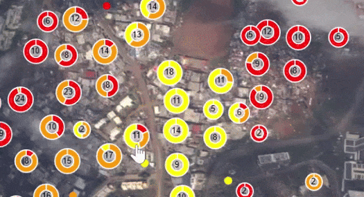

**En mode édition**, il vous suffit d'afficher le popup de l'objet. 
⚠️ Attention cependant, les objets du cluster ne sont pas modifiable en mode cluster, vous devrez désactiver le mode cluster ou zoomer au delà du seuil d'agrégation pour pouvoir éditer les objets contenus dans le cluster.

1. [Qu'est-ce que le mode cluster](mceditor/Qu'est-ce que le mode cluster)
1. [Utiliser des clusters statistiques](mceditor/Afficher les clusters statistiques)


## mceditor/créer une carte
- carte
- création
- créer

Pour créer une carte, vous devez vous rendre sur le site de [Ma carte](https://macarte.ign.fr/edition/carte), l'option est accessible dans le menu en haut à gauche <i class="fi-burger"></i>.
Vous n'avez pas besoin d'être authentifié pour créer une carte mais vous devrez le faire pour pouvoir l'enregistrer sur le site (menu <i class="fi-save"></i>). Vous pourrez néanmoins récupérer une copie de la carte sur votre ordinateur (via le menu <i class="fi-download"></i>).

L'interface vous permet d'ajouter des couches cartographiques ou de dessin, de charger des fichiers géographiques ou dessiner à l'aide des outils fournis.

1. [Quels sont les fonds disponibles dans Ma carte ?](mceditor/Quels sont les fonds disponibles dans Ma carte)
2. [Comment saisir des objets dans Ma carte ?](mceditor/Comment saisir des objets dans Ma carte)
3. [Comment puis-je sauvegarder une carte ?](mceditor/Comment puis-je sauvegarder une carte)

## mceditor/Explique moi les modes de fusion
- mode de fusion
- fusion
- combiner

Les modes de fusion permettent de définir la façon dont la couche va se combiné avec les couches inférieurs.

Il existe différents modes de fusion :
* 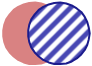 **Normal :** Il s'agit du mode par défaut. Le calque va s'afficher par dessus les autre calque et venir masquer ceux-ci.
* 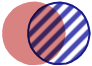 **Produit :** Les couleurs du calque vont venir se combiner avec celle du calque inférieur comme si on dessinait avec un marqueur. La couleur finale est toujours plus foncée. Le produit d'une couleur quelconque par le noir rend du noir. Le produit d'une couleur quelconque par le blanc n'a aucune incidence sur la couleur.
*  **Superposition :** Ce mode est l'inverse du produit. La couleur finale est toujours plus claire. Une superposition avec le noir n'a aucune incidence sur la couleur. Une superposition avec le blanc produit du blanc.
*  **Recouvrement :** Cet effet combine le mode produit et superposition. Lorsque la couche de base est claire, la couche supérieure devient plus claire ; là où la couche de base est sombre, le dessus devient plus sombre; là où la couche de base est gris moyen, le dessus n'est pas affecté.
* 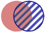 **Obscurcir :** Les pixels plus clairs que la couleur de fusion sont remplacés, et les pixels plus foncés demeurent intacts.
* 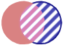 **Eclaircir :** C'est l'inverse, les pixels plus foncés que la couleur de fusion sont remplacés, et les pixels plus clairs demeurent intacts.
*  **Densité couleur + :** L'effet vient obscurcir la couleur du dessous par la couleur du calque par augmentation du contraste entre les deux. La fusion avec du blanc ne produit aucun effet.
* 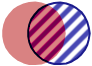 **Densité linéaire + :** L'effet vient éclaircir la couleur du dessous par la couleur du calque par réduction du contraste entre les deux. L'effet' avec du noir ne produit aucun effet.
*  **Lumière crue :** Cet effet équivaut à projeter une lumière crue sur une image.
* 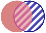 **Lumière douce :** Cet effet équivaut à projeter une lumière diffuse sur l'image.
* 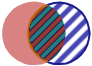 **Différence :** Cet effet soustrait la couleur de base de la couleur du calque, ou inversement, en fonction de la couleur la plus lumineuse. L'effet avec du blanc inverse les valeurs de la couleur de base. L'effet avec du noir ne produit aucun effet.
* 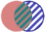 **Exclusion :** Cet effet est semblable au mode Différence avec un moindre contraste.
* 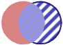 **Teinte** Cet effet va appliquer la teinte du calque aux calques inférieurs.
* 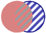 **Saturation :** Cet effet va appliquer la saturation de la couleur du calque aux calques inférieurs. Ce mode ne produit aucun effet sur une zone non saturée (avec une valeur de gris égale à 0).
* 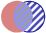 **Couleur** Cet effet va appliquer la couleur et la saturation du calque aux calques inférieurs. Ce mode préserve les niveaux de gris de l'image et est pratique pour colorer des images monochromes ou pour teinter des images en couleurs.
* 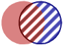 **Luminosité :** Cet effet va appliquer la luminance du calque au calques inférieurs. Ce mode crée l'effet inverse de celui du mode Couleurs.

1. [Le gestionnaire de couche](mceditor/Parle-moi du gestionnaire de couche)
1. [Ajouter un filtre à une couche](mceditor/Ajouter un filtre à une couche)

## mceditor/Parle-moi du gestionnaire de couche
- gestionnaire
- couche
- calque
- layer
- opacité
- rendu
- mode de fusion
- masquer

Les données géographiques sont regroupées dans des couches pour en faciliter la gestion. Pour des raisons de commodité, celles-ci forment un regroupement thématique ou organisationnel qui permet de manipuler d'un bloc l'ensemble les données qu'elles contiennent (afficher, changer l'ordre d'affichage, appliquer une symbolisation, etc.).

<i class="fg-layer-stack-o fa-2x"></i> Le gestionnaire de couche permet d'organiser et paramétrer les différentes couches constituant votre carte.

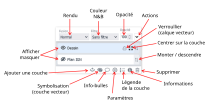
⚠️ Les actions s'appliquent à la couche sélectionnée (en surbrillance bleue).

Elle est constituée d'une barre de menu supérieure, de la liste des couches et d'une barre inférieure.

### la barre de menus supérieure

Elle permet de définir la façon dont la couche va se combiner avec les couches inférieures ([mode de fusion](#mceditor/Explique moi les modes de fusion), [filtre](#mceditor/Ajouter un filtre à une couche), opacité de la couche). Le menu action vous permet d'accéder plus rapidement à certaines fonctions de manipulation des calques.

### la liste des couches 

Elle donne des informations indiquant le nom et le statut de la couche. Lorsque la couche est sélectionnée, elle passe en surbrillance bleue.
<i class="fi-visible"></i> permet d'afficher / masquer la couche
<i class="fi-lock"></i> le verrou empêche la sélection sur une couche vecteur (la bulle ne s'affichera pas).
<i class="fi-fullscreen-alt"></i> recentre sur l'emprise de la couche (lorsque celle-ci a une emprise limitée).
<i class="fi-move"></i> la double flèche permet d'ordonner les couches par glisser/déposer.

### la barre de menus inférieure 

Elle agit sur la couche sélectionnée.

<i class="fg-layer-alt-add-o fa-fw"></i> permet d'ajouter une nouvelle couche.
<i class="fg-color fa-fw"></i> modifie la symbolisation de la couche courante.
<i class="fi-comment fa-fw"/></i> permet de choisir ce qu'on affiche dans la bulle de la couche.
<i class="fi-configuration fa-fw"></i> permet de modifier les propriétés de la couche courante.
<i class="fg-map-legend fa-fw"></i> permet de personnaliser la légende de la couche courante. 
<i class="fa fa-info-circle fa-fw"></i> contient les informations de la couche (nom, description, copyright, etc.) 
<i class="fa fa-trash-o fa-fw"></i> supprime la couche courante de la carte.

1. [Quelles sont les propriétés d'une couche ?](mceditor/Quelles sont les propriétés d'une couche)
1. [Qu'est-ce que l'info-bulle d'une couche ?](mceditor/Qu'est-ce que l'info-bulle d'une couche)
1. [Qu'est-ce que le style d'une couche ?](mceditor/Qu'est-ce que le style d'une couche)
1. [Comment ajouter une légende à une couche ?](mceditor/Comment ajouter une légende à une couche)
1. [Comment ajouter un fond sur Ma carte ?](mceditor/Quels sont les fonds disponibles dans Ma carte)
1. [Explique moi les modes de fusion](mceditor/Explique moi les modes de fusion)


## mceditor/Qu'est-ce qu'une couche vecteur
- couche
- layer
- calque
- vecteur
- raster

L'information géographique est la représentation d'un objet ou d'un phénomène réel ou imaginaire, présent, passé ou futur, localisé dans l'espace à un moment donné (on parle de géolocalisation).

Elle contient une information liée à sa position sur le globe (ou plus généralement dans l'espace) : sa **géométrie** et des **informations descriptives** sémantiques qui indiquent sa nature, son aspect, ses propriétés, etc. On parle d'attributs.
Dans certains cas, elle peut également contenir des relations avec d'autres objets : c'est le niveau topologique (le sens de parcours, la communication ou non dans un réseau, etc.). Certaines de ces relations peuvent se déduire de la géométrie des objets (inclusions, adjacences, etc.), d'autres nécessitent un encodage particulier.

On parlera de données vecteur pour les distinguer des données (ou fonds) image (ou raster). Contrairement à ces dernières, on peut facilement accéder à leurs attributs et à leur symbolisation.

1. [Qu'est-ce qu'une couche de dessin ?](mceditor/Comment saisir des objets dans Ma carte)
1. [Modifier les attributs d'un objet](mceditor/Comment ajouter des attributs à un objet)
1. [Comment personnaliser les attributs d'une couche vecteur ?](mceditor/Comment personnaliser les attributs d'une couche vecteur)


## mceditor/Qu'est-ce que l'info-bulle d'une couche
- bulle
- info-bulle
- infobulle
- popup
- calque 
- couche
- layer

Vous pouvez ajouter une bulle d'information aux calques (<i class="fi-comment"></i> dans le menu bas du gestionnaire de couche). Cette bulle s'affichera lorsqu'un objet du calque est sélectionné (sauf ci celui-ci a une bulle personnalisée).
Le contenu de la bulle est défini en Markdown et il est possible d'afficher les attributs de l'objet sélectionné avec la syntaxe `%nom_de_l_attribut%`. 
Afin de vous aider à paramétrer la bulle, pensez à sélectionner un objet sur le calque afin d'avoir accès en direct à ces attributs lors de la saisie du Markdown.

S'il s'agit d'une couche image (WMS, WMTS) la bulle affichera le résultat du getFeatureInfo du flux (si celui-ci est paramétré dans le flux et répond en json). Dans ce cas, vous n'aurez pas directement accès aux attributs du clic, vous pouvez indiquer dans le Mardown `%ATTRIBUTES%` pour afficher la liste des attributs renvoyés par le service.

1. [Comment paramétrer l'info-bulle d'un objet ?](mceditor/Comment paramétrer l'info-bulle d'un objet)
1. [Qu'est-ce que le Makdown ?](md/markdown)
1. [Modifier les attributs d'un objet](mceditor/Comment ajouter des attributs à un objet)


## mceditor/Qu'est-ce que le mode cluster
- couche
- calque
- layer
- mode
- afficher
- affichage
- cluster
- clusters
- grappes

Pour les objets ponctuels ou pour des objets surfaciques de petite taille, on peut utiliser la méthode des **clusters**.

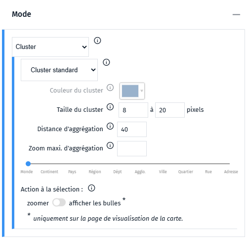

Le principe des clusters (ou grappes) permet de regrouper un ensemble de données en différents "paquets" homogènes suivant un critère de proximité que l'on définit en introduisant une distance entre objets (40 pixels par défaut). En dessous de cette distance les points vont s'agréger.


Cela a l'avantage d'améliorer la lisibilité de la carte en présentant les regroupements. On peut également définir un niveau de zoom à partir duquel les objets ne seront plus regroupés afin de permettre une meilleure visibilité de l'information granulaire.

⚠️ En mode édition il n'est plus possible d'accéder aux objets que contiennent les clusters. En particulier vous ne pourrez plus modifier le style des objets ou les déplacer (vous déplacerez le cluster qui se recalculera au prochain déplacement). Vous devrez déactiver le mode d'affichage des clusters ou zoomer au-delà du seuil d'agrégation.

Il existe 3 type de clusters : les clusters standards avec 3 couleurs en fonction du nombre d'objets dans le cluster, les clusters colorés pour lesquels on peut choisir la couleur et [les clusters statistiques](#mceditor/Afficher les clusters statistiques).

1. [Utiliser des clusters statistiques](mceditor/Afficher les clusters statistiques)
1. [Comment voir ce que contient un cluster](mceditor/Comment voir ce que contient un cluster)


## mceditor/Qu'est-ce que le style d'une couche
- style
- couche
- layer
- calque

Chaque couche vecteur peut avoir un style de représentation des objets qu'elle contient. C'est cette symbolisation qui sera utilisée si elle n'a pas été surchargée par l'objet lui-même (dans ce cas on peut revenir à la symbolisation par défaut de la couche).

La couche peut adopter une **symbolisation paramétrique**, dans ce cas, elle sera prioritaire et prendra le pas sur la symbolisation des objets. On utilise alors les règles définies dans la couche pour symboliser son contenu.
Ceci a l'avantage de pouvoir plus facilement changer la symbolisation d'un groupe d'objet et de la rendre plus dynamique (si l'attribut d'un objet change, sa symbolisation va changer). Cela va également être pratique si on doit mettre à jour une couche de dessin (nouveau millésime de la donnée).
Dans le cas de couche vecteur en flux, c'est la seule façon d'affecter une symbolisation différente aux objets affichés.

On peut modifier la symbolisation d'une couche via le bouton <i class="fg-color"></i> dans la barre inférieure du gestionnaire de couche.

1. [Qu'est-ce qu'une représentation paramétrique ?](symboliser/Qu'est-ce qu'une représentation paramétrique)
2. [Comment créer une bibliothèque de symboles ?](mceditor/Comment créer une bibliothèque de symboles)
2. [Comment mettre à jour les données d'un calque de dessin ?](mceditor/Comment mettre à jour les données d'un calque de dessin)


## mceditor/Quelles sont les propriétés d'une couche
- propriété
- couche
- layer
- calque
- options

Les propriétés d'une couche sont de deux types : 

<i class="fa fa-info-circle"></i> Les **informations** qui servent à la décrire et qui seront visibles par l'utilisateur dans le gestionnaire de couche. En particulier le nom et la description de la couche ainsi qu'un copyright qui s'affichera sur la carte. 
Une couche contenant des données vecteur peut être exportable (case à cocher), ce qui se traduira par un bouton pour télécharger les données dans le dialogue d'information de la couche.
Enfin, une couche peut avoir une thématique et un logo.

<i class="fi-configuration"></i> les options de la couche qui conditionnent son affichage.
On trouve ici la plage de visibilité qui définit les échelles auxquelles la couche va s'afficher ainsi que le masque de découpage.
Pour les couches vecteurs, on peut définir le mode d'affichage et les attributs de la couche.
Le mode d'affichage peut être vecteur (normal), image qui permet d'optimiser l'affichage lors des déplacements (utile pour les couches ayant beaucoup d'objets à afficher) et le mode cluster qui permet de regrouper les objets à petite échelle.
Pour les objets vecteurs, on peut aussi personnaliser les attributs du calque et la façon dont ils sont stockés/affichés.

1. [Qu'est-ce qu'une couche vecteur ?](mceditor/Qu'est-ce qu'une couche vecteur)
1. [Comment personnaliser les attributs d'une couche vecteur ?](mceditor/Comment personnaliser les attributs d'une couche vecteur)
1. [A quoi sert la thématique d'une couche ?](mceditor/A quoi sert la thématique d'une couche)
1. [Comment créer un masque de découpage ?](mceditor/Comment créer un masque de découpage)

## mceditor/Quels sont les fonds disponibles dans Ma carte
- fonds
- geoportail
- carte
- WMTS
- ajouter
- couche
- layer

Ma carte offre un grand nombre de fonds cartographiques disponibles pour agrémenter vos cartes en ligne.
Vous pouvez choisir les fonds lors de la création de la carte (via l'assistant) ou par le menu d'ajout de couche dans le gestionnaire de couches <i class="fg-layer-alt-add-o"></i>.

Parmi ceux-ci, on trouve un accès simplifié aux fonds cartographiques du Géoportail par thématique.
En cliquant sur le bouton `Plus d'options`, vous avez un large choix de fonctionnalités pour ajouter des flux provenant de services tiers dans des formats standardisés (OGC).


1. [Ajouter des fonds Géoportail simplement](mceditor/Comment ajouter des fonds Géoportail)
1. [Ajouter des flux OGC](mceditor/Comment ajouter des flux OGC)
1. [Ajouter des tuiles vectorielles](mceditor/Comment ajouter des tuiles vectorielles)
1. [Parle-moi du gestionnaire de couche](mceditor/Parle-moi du gestionnaire de couche)

## mceditor/Quels sont les raccourcis claviers de dessin
- raccourcis
- dessin
- Ctrl+C

Dans l'outil de dessin vous avez accès aux raccourcis suivant : 
<kbd>Ctrl</kbd>+<kbd>C</kbd> pour copier le ou les objets sélectionnés.
<kbd>Ctrl</kbd>+<kbd>X</kbd> pour copier le ou les objets sélectionnés en les supprimant du calque dans lequel ils se trouvent.
<kbd>Ctrl</kbd>+<kbd>V</kbd> pour coller le ou les objets copiés sur le calque de dessin courant (le calque doit être visible <i class="fi-visible"></i> et déverrouillée (<i class="fi-unlock"></i>).
<kbd>Suppr</kbd> pour supprimer les objets sélectionnés.

## mceditor/Quels sont les référentiels géographiques utilisés par Ma carte
- coordonnées
- référentiels
- WGS84

### Affichage

L'affichage des coordonnées peut se faire en coordonnées géographiques, latitude longitude, en degrés décimaux ou sexagésimaux ou en Web Mercator qui est la projection standard utilisée par les outils de visualisation cartographique web.

### Données

L'import de données vectorielles doit se faire en degrés décimaux (WGS84, code EPSG:4326) ou en Web Mercator (EPSG:3857). Pour utiliser des données exprimées dans une autres projection une conversion en amont est nécessaire.
L'export se fait en coordonnées géographiques décimales (WGS84, code EPSG:4326)

1. [Ajouter un fichier à un calque](mceditor/Comment ajouter des données à un calque)
1. [Enregistrer les données d'un calque](mceditor/Comment enregistrer les données d'un calque)

## mceditor/video layer legend
- légende
- layer
- vidéo

<iframe width="560" height="315" src="https://www.youtube.com/embed/jUpyyGZF3vg?si=3fHPsLpQe5E17ewl" title="YouTube video player" frameborder="0" allow="accelerometer; autoplay; clipboard-write; encrypted-media; gyroscope; picture-in-picture; web-share" referrerpolicy="strict-origin-when-cross-origin" allowfullscreen></iframe>

1. [Comment ajouter une légende à une couche ?](mceditor/Comment ajouter une légende à une couche)
1. [Comment créer une légende ?](mceditor/Comment créer une légende)


## mceditor/video legende
- legende
- vidéo

<iframe width="560" height="315" src="https://www.youtube.com/embed/F4P0JSpOu5U?si=D9jAS34DhQWXCdJT" title="YouTube video player" frameborder="0" allow="accelerometer; autoplay; clipboard-write; encrypted-media; gyroscope; picture-in-picture; web-share" referrerpolicy="strict-origin-when-cross-origin" allowfullscreen></iframe>

1. [Comment créer une légende ?](mceditor/Comment créer une légende)


## mceditor/video masque de découpage
- masque
- découpage
- video

<iframe width="560" height="315" src="https://www.youtube.com/embed/QdcOrxRe36Y?si=lOjUl6c2cJjCkIUT" title="YouTube video player" frameborder="0" allow="accelerometer; autoplay; clipboard-write; encrypted-media; gyroscope; picture-in-picture; web-share" referrerpolicy="strict-origin-when-cross-origin" allowfullscreen></iframe>

1. [Comment créer un masque de découpage ?](mceditor/Comment créer un masque de découpage)
1. [Quelles sont les propriétés d'une couche ?](mceditor/Quelles sont les propriétés d'une couche)

## mcstat/Comment créer une carte statistique
- carte
- statistique
- stat
- carte statistique
- couche
- layer
- calque
- éditeur
- création
- créer
- faire

Ma carte propose un outil de création de [couches statistiques](https://macarte.ign.fr/edition/statistique/).

La cartographie thématique visualise les données sur la base de concepts spatiaux tels que la densité, les proportions, les pourcentages, les indices ou les tendances, des moyennes... Il est donc nécessaire d'avoir accès à de l'information et à des données chiffrées concernant la thématique abordée (généralement un fichier tableur).
Pour cela, elle s'appuiera sur des analyses statistiques qui lui fourniront, par exemple pour décrire les forêts: les densités des boisements, la répartition des espèces, les types ou les volumes de productions, etc...

Afin de représenter un phénomène sur une carte, il est nécessaire d'avoir sa position dans l'espace, pour cela, [plusieurs maillages sont proposées](#mcstat/Quels sont les maillages disponibles pour les statistiques) (pays, département, commune, etc.).

Le module propose différents [types de cartes statistiques](#mcstat/Quels sont les types de cartes statistiques proposés) afin carte statistique
de mettre en forme des données provenant d'un fichier tableur ou géographique sous forme de cartes de dégradés (ou choroplèthe), de cartes de catégories, de symboles, avec une représentation par symbole ou carte de chaleur.
Vous pouvez choisir la [méthode de classification](#mcstat/Les méthodes de classification) ainsi que [les couleurs ou les symboles](#mcstat/les couleurs et les symboles statistiques) qui seront utilisés sur la carte statistique.

Une fois la carte enregistrée, vous pouvez la reprendre sous forme de carte pour changer les fonds de cartes ou ajouter de l'information par-dessus. 
Vous pouvez également charger une nouvelle couche statistique depuis une carte existante afin de les croiser avec la statistique courante.

1. [Quels sont les types de carte statistique proposés ?](mcstat/Quels sont les types de cartes statistiques proposés)
1. [Comment formater un fichier pour faire une carte statistique ?](mcstat/Comment formater un fichier pour faire une carte statistique)
1. [Quels sont les maillages disponibles pour les statistiques ?](mcstat/Quels sont les maillages disponibles pour les statistiques)
1. [Comment optimiser une carte statistique ?](mcstat/Comment optimiser une carte statistique)
1. [Comment importer une couche d'une autre carte ?](mceditor/Comment importer une couche d'une autre carte)

## mcstat/Comment formater un fichier pour faire une carte statistique
- formater
- csv
- excel
- xls
- statistique
- jointure

Dans votre fichier, vos données doivent être organisées de façon à rendre la statistique possible :
1. Une donnée correspond à une ligne du fichier
2. Les informations doivent être organisées de la même façon pour chaque ligne
3. Les données doivent contenir une colonne permettant d'indiquer à quel objet géographique il se réfère (maillage) ou une colonne indiquant la longitude et latitude de l'information
4. Enfin il est nécessaire d'avoir une colonne codant une statistique à représenter...

1. [Faire une carte statistique](mcstat/Comment créer une carte statistique)
1. [Quels sont les maillages disponibles pour les statistiques ?](mcstat/Quels sont les maillages disponibles pour les statistiques)
1. [Comment optimiser une carte statistique ?](mcstat/Comment optimiser une carte statistique)


## mcstat/Comment optimiser une carte statistique
- optimiser
- améliorer
- statistique
- alléger
- allégé
- maillage
- découpage

Une carte statistique peut contenir beaucoup d'objets (un découpage par commune contient plus de 3600 objets), ce qui peut altérer les performances. Dans ce cas, il est conseillé d'utiliser une version allégée des maillages proposés par l'outil.
La version allégée des maillages diminue le nombre de points (et la taille des données). Elle va donc permettre d'optimiser le chargement et l'affichage des données.

Ainsi il est conseillé d'utiliser le maillage par commune allégé pour une représentation nationale. Par contre, pour présenter une statistique sur un département ou une région un maillage communal standard peut être plus adapté.
Si vous voulez faire une symbolisation ponctuelle (par symboles ou sectorielle), le maillage allégé est à privilégier (de toute façon, c'est le centre de la maille qui sera utilisé).

1. [Comment améliorer l'affichage d'une carte ?](mceditor/Comment améliorer l'affichage d'une carte)
1. [Quels sont les maillages disponibles pour les statistiques ?](mcstat/Quels sont les maillages disponibles pour les statistiques)
1. [Comment formater un fichier pour faire une carte statistique ?](mcstat/Comment formater un fichier pour faire une carte statistique)


## mcstat/les couleurs et les symboles statistiques
- statistique
- couleur
- couleurs
- palette

Les palettes proposées sont des combinaisons de couleurs sélectionnées pour leurs propriétés perceptives dans l'optique de la visualisation de données.

Ces palettes ont été créés par [Cynthia Brewer](http://www.colorbrewer2.org/) à des fins de cartographie, mais ont également trouvé une utilisation dans bien d'autres domaines.

### Le défi

Un choix de couleurs efficaces pour l'affichage de données statistiques (graphique de barres, camemberts, carte statistique, thématique ou de chaleur) est d'autant plus difficile que la façon dont nous choisissons la couleur ne reflète pas la façon dont la nous percevons.

Il existe de nombreux exemples de mauvaises combinaisons de couleurs publiés sur le web. Ainsi, des catégories encodées avec une combinaison de couleurs claires et sombres, donneront une préférence aux couleurs vives qui vont dominer l'attention du lecteur.
D'autre part, si deux couleurs semblent similaires, le lecteur va instinctivement les percevoir comme appartenant à un groupe et en déduire que les variables sous-jacentes sont liées.

Les couleurs avec un faible contraste (dont la luminosité est perçue similaire) ou avec un contraste simultané (couleurs pures) interfèrent également avec les mécanismes d'interprétation.

### Les différents types de Palettes
Il existe quatre types de palettes :
* **coloré** : ce sont des palettes séquentielles à une seule valeur, elles utilisent un dégradé à partir d'une couleur de base
* **séquentiel** : les couleurs ont un ordre perçu avec une différence entre couleurs successives uniformes. Elles sont adaptées pour des données ordonnées avec une variation de valeur continue (gradient).
* **divergent** : elles utilisent deux palettes séquentielles dos à dos à partir d'une couleur commune. Elles accordent la même importance aux différentes valeurs des données.
* **qualitatif** - les couleurs n'ont pas d'ordre perçu. Elles sont adaptées pour représenter des données catégorielles ou nominales.

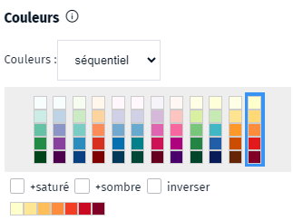

### Personnalisation des couleurs
Afin de maximiser la différenciation des couleurs entre elles, les palettes proposées dépassent	rarement 10 classes.
Or,
* pour certains types de configuration spatiale, il peut être utile d'avoir plus de 10 classes
* pour des données catégorielles, il peut être intéressant de pouvoir choisir la couleur d'une catégorie
* pour valoriser la mise en exergue d'un phénomène on peut avoir recours à une couleur tranchée pour la classe concernée


1. [Faire une carte statistique](mcstat/Comment créer une carte statistique)
1. [Quels sont les types de cartes statistiques ?](mcstat/Quels sont les types de cartes statistiques proposés)
1. [Quels sont les méthodes de classification proposées ?](mcstat/Les méthodes de classification)


## mcstat/Les méthodes de classification
- statistique
- méthode
- classification
- classe
- quantile

Cinq méthodes de classification vous sont proposées. Une information contextuelle les détaille. Les méthodes s'appliquent aux types de carte choroplèthes et symboles.

Afin de représenter les données sur la carte, nous devons les répartir dans des **classes** sur lesquelles on pourra définir un style de représentation donné.

### Quantiles
Les quantiles sont les valeurs qui partagent un jeu de données en n parts égales.
Ainsi, si on découpe un jeu de 20 données en 4 classes, elles contiendront 5 données chacune.

### Equidistance
Une répartition par équidistance partage un jeu de données en *n* parts de même largeur.
Ainsi si notre jeu de données a une valeur minimale de 2 et une valeur maximale de 14 (donc une amplitude de 12) et qu'on le découpe en 4 classes, elles auront chacune une largeur de 3.

### Logarithmique
Ce mode utilise une répartition équidistante mais sur une échelle logarithmique.

### Cluster ou k-moyenne
Une répartition par cluster (ou k-moyenne) consiste à découper un jeu de données en parts, appelées clusters, de façon à minimiser une fonction de distance entre les individus. 
📌 Cette méthode de répartition ne garantit pas d'obtenir exactement le nombre de classes demandé par l'utilisateur, car ce nombre de classes est par construction lié à la répartition des valeurs de la variable à cartographier.

### Jenks
La méthode de Jenks maximise la variance entre les classe et minimise la variance à l'intérieur des classes de la discrétisation. Elle aboutit à un résultat où les individus regroupés dans une même classe sont le moins dispersés possible au sens statistique et donc les plus homogènes tandis que les moyennes des classes sont les plus éloignées.

### Head / tail
La discrétisation Head/tail, proposée en 2013 par le géographe Bin Jiang, dessine fort bien les données hiérarchisées dont la distribution dissymétrique comprend typiquement beaucoup de petites valeurs et quelques valeurs élevées. 
Head/tail prend la moyenne comme premier seuil, puis calcule de façon itérative des moyennes emboîtées sur les données supérieures (head).
📌 Elle permet de faire ressortir les têtes du classement.

### Manuelle
Vous définissez vous-même les bornes des classes à la main.

1. [Faire une carte statistique](mcstat/Comment créer une carte statistique)
1. [Quels sont les types de cartes statistiques ?](mcstat/Quels sont les types de cartes statistiques proposés)
1. [Comment choir les couleurs des statistiques ?](mcstat/les couleurs et les symboles statistiques)


## mcstat/Puis-traiter plusieurs fichiers en même temps
- plusieurs fichiers
- statistique
- couche
- layer

Vous ne pouvez traiter qu'une **seule couche statistique à la fois**. 
Si vous avez plusieurs fichiers, ils doivent être traités individuellement.

Pour chaque fichiers vous créez une nouvelle couche statistique avec sa légende, vous pourrez ensuite combiner ses différentes statistiques en utilisant le [module de création de carte](#mceditor/Comment importer une couche d'une autre carte).

Pour charger une couche statistique dans le module de création de carte, cliquez sur le bouton pour ajouter un fond cartographique dans le gestionnaire de couche (<i class="fg-layer-alt-add-o"></i>), puis choisissez `"Depuis une autre carte..."`

1. [Faire une carte statistique](mcstat/Comment créer une carte statistique)
1. [Comment charger une couche depuis une carte statistique dans Ma carte ?](mceditor/Comment importer une couche d'une autre carte)
1. [Quels sont les types de carte statistique proposés ?](mcstat/Quels sont les types de cartes statistiques proposés)
1. [Comment formater un fichier pour faire une carte statistique ?](mcstat/Comment formater un fichier pour faire une carte statistique)


## mcstat/Quels sont les maillages disponibles pour les statistiques
- maillage
- statistique
- découpage
- commune
- département

Afin de représenter un phénomène sur une carte, il est nécessaire d'avoir sa position dans l'espace.
Cette position peut être intégrée dans le fichier géographique (GeoJSON) ou liée à un découpage existant (maillage).
Différents maillages sont proposés par l'outil (communes, départements, EPCI, bassin de vie, IRIS, régions, états). Certains maillages dépendent de l'année des données utilisées (ainsi des communes peuvent fusionner et modifier le maillage d'une année sur l'autre).

Il faudra préciser lors de l'import des données le type de découpage (maillage) utilisé et l'attribut servant à coder le lien :
- pour les départements, le lien se fait sur le numéro de département (01 = département de l'Ain),
- pour les communes il s'agit du code INSEE de la commune (01001 = commune de L'Abergement-Clémenciat),
- pour les pays, on utilise le code ISO (fr = France).

Certains maillages sont fournis avec une version allégée pour optimiser l'affichage des statistiques.

Lorsqu'on n'a pas de coordonnées associées à une série de données, mais qu'on a des informations de localisation à l'adresse, à la commune ou au lieu-dit, on peut utiliser des outils de [géocodage](#mcadresse/Localiser une couche d'adresse) pour en déduire des coordonnées.

1. [Faire une carte statistique](mcstat/Comment créer une carte statistique)
1. [Comment géocoder un fichier d'adresse ?](mcadresse/Localiser une couche d'adresse)
1. [Comment optimiser une carte statistique ?](mcstat/Comment optimiser une carte statistique)


## mcstat/Quels sont les types de cartes statistiques proposés
- statistique
- type
- choroplèthe
- catégorie
- symbole
- sectorielle
- chaleur
- heatmap

Plusieurs type de carte sont proposés.

### Carte dégradée ou choroplèthe

Une carte choroplèthe, du grec chôros (χώρος), zone/région et plethos (πληθαίν), multiple, est une carte statistique en aplat de couleur suivant un attribut de type numérique qui servira à définir une classification.
Elle est particulièrement adaptée à représenter une mesure statistique, comme la densité d'un phénomène. Ce type de carte facilite la comparaison d'une mesure d'une région à l'autre, ou montre la variabilité du phénomène.
Les données à représenter sont plutôt de type surfacique (dans le cas de données ponctuelles, on lui préférera généralement une carte de symbole).

### Carte par catégories

C'est une carte en aplat de couleur en fonction d'un attribut de tous types. Dans ce cas, ce sont les valeurs d'un attribut qui serviront à coder la couleur.
Elle ne peut pas représenter un phénomène statistique ordonné mais peut indiquer la répartition spatiale d'un phénomène.

### Carte de symboles proportionnels

Ce type de carte permet l'affichage d'un symbole suivant un attribut numérique qui code la classe et la grosseur du point affiché.
Il est particulièrement indiqué pour représenter un phénomène impliquant une quantité. La taille du cercle peut être répartie entre deux valeurs ou proportionnelle à la quantité.
La proportionnalité peut s'appliquer sur des points (taille du symbole) ou sur des lignes (largeurs). Dans ce cas, la largeur de la ligne va indiquer la valeur représentée (fréquentation d'une route par exemple).

### Carte sectorielle

Ce type de carte représente sous forme de diagramme statistique (camembert, barres) un phénomène localisé sur un point. Lorsqu'il s'applique à une surface, il est localisé sur un point à l'intérieur de celle-ci (centroïde).
La superposition intégrale en un seul point étant impossible (sauf à passer en 3D), il permet de représenter plusieurs variables (attributs) en même temps et est recommandé pour visualiser un phénomène impliquant plusieurs candidats (résultat d'élection par exemple).
La taille du graphique correspond à la valeur totale des variables représentées. On peut le conditionner entre deux valeurs ou l'afficher de manière proportionnelle.

### Carte d'activité ou carte de chaleur

Une carte de chaleur est une représentation cartographique qui, à la grandeur d'une variable, fait correspondre une teinte donnée dans une palette de couleurs.
C'est une carte d'accumulation et deux phénomènes proches spatialement vont s'additionner (se cumuler) sur la carte. Elle nécessite d'avoir des données ponctuelles pour fonctionner. Par défaut, seule la position du point est utilisée mais en choisissant un attribut numérique, on va pouvoir donner un poids au point représentant le phénomène.

1. [Faire une carte statistique](mcstat/Comment créer une carte statistique)
1. [Quels sont les méthodes de classification proposées ?](mcstat/Les méthodes de classification)
1. [Comment choir les couleurs des statistiques ?](mcstat/les couleurs et les symboles statistiques)


## mcstory/Comment modifier une carte narrative
- narration
- storymap
- carte narrative
- modifier

Une carte narrative est un conteneur qui contient une ou plusieurs cartes préalablement réalisée avec Ma carte (suivant le modèle de narration choisi).

L'information géographique est contenue dans la ou les cartes qui composent la carte narrative.
Si vous souhaitez modifier le contenu d'une carte narrative, il faut intervenir dans la carte (ou les cartes) qui la compose(nt) en utilisant l'[éditeur Ma carte](#mceditor/créer une carte).

Seuls les paramètres de mise en forme sont modifiables dans l'interface de Ma carte narrative :
* un titre et un sous-titre
* des couleurs de fond et de texte personnalisées pour valoriser vos réalisations, respecter une charte graphique
* l'adjonction d'un logo pour signer votre identité
* des widgets pour faciliter l'utilisation de la carte : recherche d'adresse, gestionnaire de calques, outils de mesure, outils de croquis, coordonnées du pointeur, légende, ...
* la configuration des info-bulles et volets
* l'affichage d'une description pour apporter à l'internaute des informations complémentaires sur la narration.

Les narrations plus complexes peuvent contenir d'autres éléments (les étapes par exemple).

Si vous modifiez une carte (dans le module d'édition) pour voir apparaître les modification dans la carte narrative vous devez cliquer sur le bouton rafraîchir (<i class="fi-repeat"></i>) dans l'onglet carte.

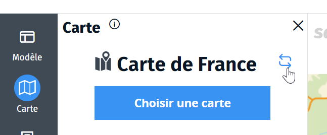

1. [Quels sont les modèles de carte narrative proposés ?](mcstory/Quels sont les modèles de carte narrative proposés)
1. [Montre-moi des exemples de cartes narratives](mcstory/exemples de cartes narratives)


## mcstory/exemples de cartes narratives
- exemple
- carte
- narrative
- storymap
- narration

Voici quelques exemples de cartes narratives : 
- Modèle standard : [Patrimoine de la biodiversité](https://macarte.ign.fr/carte-narrative/voir/12ca4efdf0956c7c9945b3cd2feab687/Patrimoine-naturel-de-la-biodiversite) -  J-M. Viglino
- Modèle volet : [Lieux de tournage à Paris](https://macarte.ign.fr/carte-narrative/voir/aad127aedc4c7d10e372ad6d617c8c95/Lieux_de_tournage_a_Paris) -  J-M. Viglino
- Modèle photo : [La Route des Alpes - BnF](https://macarte.ign.fr/carte-narrative/voir/1e99baa82a09055d0aecd8a7cdd5c1d4/BnF-Route-des-Alpes) -  J-M. Viglino
- Modèle diaporama : [Les lieux du stade](https://macarte.ign.fr/carte/5SkrR6/Les-lieux-du-stade) -  A. Sandrin
- Modèle étapes : [L'attractivité urbaine en France](https://macarte.ign.fr/carte-narrative/voir/95b97c69c0d2713614845761857ea034/Attractivite_urbaine_France) -  M. Chartier
- Modèle onglet : [La France face à la montée des eaux](https://macarte.ign.fr/carte-narrative/voir/baca818328b9ea4d3a2d36332033c842/La_France_face_a_la_montee_des_eaux) -  J. Pouzin
- Modèle comparaison : [Lyon Métropole face à une crue majeure](https://macarte.ign.fr/carte-narrative/voir/722968cde123b481d4eb39c6e8c8efa2/Risque_inondation_a_Lyon) -  M. Chartier
- Modèle différentiel : [Occupation du sol Bourgogne-Franche-Comté](https://macarte.ign.fr/carte/UP9ae8/OCS-BFC-indicateurs) -  J-M. Viglino

1. [Montre-moi des exemples de cartes](macarte/exemples)
1. [Raconter une histoire sur une carte](mcstory/raconter une histoire)


## mcstory/Quels sont les modèles de carte narrative proposés
- modèle
- carte narrative
- narration
- storymap

Un modèle est une mise en forme prédéfinie prête à accueillir vos cartes réalisées précédemment avec l'application Ma carte, de les habiller en leur ajoutant un titre, un logo, des couleurs, une description et de bâtir à partir de là une carte avantageuse et dynamique.

De nombreux modèles de cartes narratives vous sont proposés afin de satisfaire vos attentes.

### Modèle standard
 
À l'exception de la barre de titre et de la légende optionnelle, la carte remplit tout l'espace. L'info-bulle s'affiche par-dessus la carte.
💡 Idéal pour une utilisation simple et rapide de votre carte sur un écran d'ordinateur.

### Modèle volet
 
À la sélection, les informations s'affichent dans un volet latéral. Sur les appareils mobiles, le volet est rétracté si aucun objet n'est sélectionné afin de laisser un maximum d'espace à la carte.
💡 Idéal pour une utilisation de votre carte avec un smartphone comme sur un écran d'ordinateur.

### Modèle photo
 
Un bandeau affiche une vue réduite de toutes les photos associées aux objets présents dans la fenêtre cartographique et un volet latéral affiche les informations de l'objet sélectionné. Un clic sur une photo dans le bandeau permet de sélectionner l'objet correspondant.
💡 Idéal pour une présentation visuelle de lieux et des informations associées.

### Modèle diaporama
 
Un bandeau affiche une vue réduite de toutes les photos associées aux objets présents dans la fenêtre cartographique. Un clic sur une photo réduite dans le bandeau affiche celle-ci en grand sur la carte.
💡 Idéal pour présenter des photos de lieux de façon dynamique et intuitive.

### Modèle étapes
 
Lors de la création de la carte différents états sont enregistrés (calques visibles, centrage, échelle d'affichage) et commentés. À la lecture de la carte les étapes sont enchainées avec les commentaires affichés dans un volet latéral.
💡 Idéal pour présenter une narration basée sur un itinéraire.

### Modèle onglet
 
Plusieurs cartes narratives sont associées en une seule, chacune étant accessible via un onglet.
💡 Idéal pour regrouper des cartes partielles en un tout cohérent.

### Modèle comparaison
 
Deux cartes sont affichées côte à côte à la même échelle, centrées de façon identique. Les déplacements des deux cartes sont synchronisés et présentent toujours la même zone.
💡 Idéal pour étudier ou présenter des évolutions ou comparer des données.

### Modèle différentiel
 
Le modèle différentiel permet de comparer deux objets en affichant conjointement leur fiche.
💡 Idéal pour comparer des données statistiques.


1. [Montre-moi des exemples utilisant ces modèles](mcstory/exemples de cartes narratives)
1. [Comment modifier une carte narrative ?](mcstory/Comment modifier une carte narrative)

## mcstory/raconter une histoire
- carte narrative
- narrative
- storymap
- narration
- personnaliser
- expérience
- histoire

Une carte narrative permet de personnaliser une carte pour **raconter une histoire** et accompagner le public dans la découverte des cartes que vous produisez.
Plusieurs modèles de cartes narratives sont proposés afin de personnaliser la façon dont l'utilisateur va interagir avec la carte et la façon dont celle-ci s'affichera.

⚠️ Une carte narrative ne peut pas être réalisée sans avoir préalablement fait une carte avec l'application Ma carte. Cette carte contient les données, la narration ne contient que l'habillage de la carte.
Si vous modifiez la carte intégrée à la narration, la modification sera répercutée sur la narration. Attention donc à ne pas faire des modifications qui la rendront incompréhensible.
Vous pouvez réaliser plusieurs cartes narratives différentes avec une même carte pour offrir une expérience utilisateur différente et raconter une histoire.

Comme une carte standard, une carte narrative peut être partagée via une url, dans une iFrame ou sur les réseaux sociaux.
Elles peuvent être publiées dans l'Atlas.

1. [Quels sont les modèles de carte narrative proposés ?](mcstory/Quels sont les modèles de carte narrative proposés)
1. [Montre-moi des exemples de cartes narratives](mcstory/exemples de cartes narratives)


## md/Afficher des attributs en Markdown
- Markdown
- MD
- attributs
- propriétés
- attribut

Il est possible d'afficher des attributs associés à l'objet sélectionné en Markdown en utilisant la syntaxe `%nom_de_l_attribut%`.
Diverses options sont disponibles pour formater les attributs (complément d'affichage, affichage conditionnel, etc.).

Pour plus d'informations, consultez l'aide en ligne disponible dans l'outil.

1. [Montre-moi la barre de Markdown de Ma carte](md/la barre de Markdown de Ma carte)
1. [Comment ne pas afficher un attribut vide ?](md/Comment ne pas afficher un attribut vide)
1. [Qu'est-ce que le Makdown ?](md/markdown)
1. [Modifier les attributs d'un objet](mceditor/Comment ajouter des attributs à un objet)


## md/Afficher une diagramme dans Ma carte
- Markdown
- MD
- diagramme
- statistique
- camembert
- pie chart
- info-bulle
- infobulle

Il est possible d'afficher des diagrammes dans les info-bulles ou dans les textes de vos narrations.
Pour cela, vous devez utiliser un widget Markdown `chart`
```
&#96chart
data: 3;1;5
&#96
```
Différentes options et types de diagrammes sont disponibles : bâtons (verticaux ou horizontaux), lignes, circulaire, radar et vous pouvez mixer des lignes et des barres.
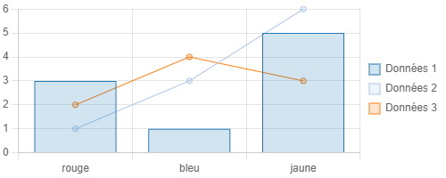

Vous pouvez également utiliser les attributs de l'objet sélectionné pour afficher un diagramme spécifique à la sélection.

💡 Pour plus d'informations, consultez l'aide en ligne disponible dans la barre de Markdown.

1. [Afficher des attributs en Markdown](md/Afficher des attributs en Markdown)
1. [Montre-moi la barre de Markdown de Ma carte](md/la barre de Markdown de Ma carte)
1. [Qu'est-ce que le Makdown ?](md/markdown)


## md/Comment ajouter un comparateur d'image
- markdown
- md
- image
- comparateur
- comparer
- slider

Vous pouvez ajouter un comparateur d'images dans vos narrations ou vos info-bulles en utilisant un widget `imageSlider`.
Il est possible de préciser la taille des images (sous la forme `largeurxhauteur`). Si la largeur ou la hauteur n'est pas précisée elle sera calculée par rapport à l'autre dimension.s
Deux images sont nécessaire au widget. Il est préférable que les deux images aient la même taille.
L'option `fullscreen` ajoute un bouton pour afficher le widget en plein écran.

```md
&#96imageSlider
img1: url_image_1
img2: url_image_2
fullscreen: true
&#96
```

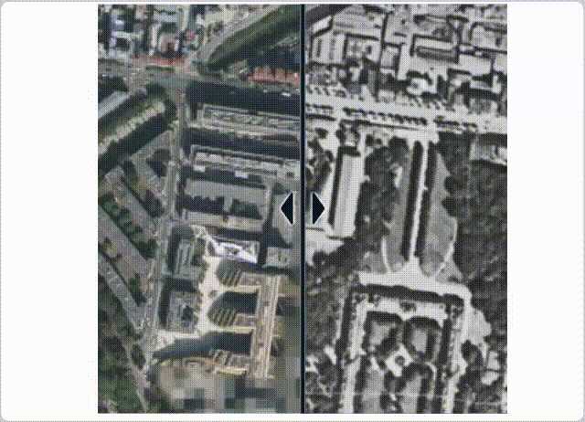

1. [Qu'est-ce que le Makdown ?](md/markdown)
1. [Montre-moi la barre de Markdown de Ma carte](md/la barre de Markdown de Ma carte)
1. [Intégrer des médias dans Ma carte](md/Intégrer des médias dans Ma carte)
1. [En savoir plus sur les widgets Markdown](md/En savoir plus sur les widget Markdown)

## md/Comment ne pas afficher un attribut vide
- afficher
- formater
- attribut
- attributs
- vide
- null
- affichage conditionnel
- conditionnel
- test conditionnels
- MD
- Markdown

Il est possible de conditionner l'affichage à la présence (ou non) d'un attribut lors de l'affichage de la fiche d'un objet.
Pour cela, il suffit de mettre l'attribut entre double parenthèses `((%attr%))`.
Dans ce cas, l'ensemble de l'expression entre parenthèses s'affiche ou non suivant la valeur de l'attribut.
Par exemple : `((longueur : %length% km))` n'affichera rien si length est vide (ou nul) et affichera `longueur : 10 km` si length=10.

Il est possible d'ajouter un texte alternatif qui s'affichera en lieu et place si l'attribut n'est pas défini en l'ajoutant dans les parenthèses après une double barre : `||`
Par exemple : `((valeur : %val% || pas de valeur))`

On peut aussi tester explicitement l'existence ou non d'un attribut pour en afficher un autre, en utilisant `((?%attr%` ou `((!%attr%`.
Par exemple pour afficher une valeur ou une erreur en fonction d'un boolean (dans l'attribut `isok`): 
`((?%isok% la valeur est %attr%))((!%isok% il y a une erreur : %error%))`

1. [Montre-moi une vidéo](md/video attribut conditionnel)
1. [Qu'est-ce que le Makdown ?](md/markdown)
1. [Comment afficher des attributs en Markdown](md/Afficher des attributs en Markdown)
1. [Comment intégrer des médias dans Ma carte](md/Intégrer des médias dans Ma carte)


## md/En savoir plus sur les widget Markdown
- widget
- markdown
- MD
- images
- vidéo
- twitter
- diagramme

Les widgets Markdown vous permettent d'afficher des contenus évolués en Markdown.

Vous pouvez ainsi afficher du code, un [comparateur d'images](#md/Comment ajouter un comparateur d'image), un calendrier ou [des diagrammes](#md/Afficher une diagramme dans Ma carte).

Une aide en ligne est disponible dans le <i class="fi-info"></i> de la [barre de Markdown](#md/la barre de Markdown de Ma carte).

1. [Intégrer des médias en Markdown](md/Intégrer des médias dans Ma carte)
1. [Afficher une diagramme en Markdown](md/Afficher une diagramme dans Ma carte)
1. [Comment ajouter un comparateur d'images](md/Comment ajouter un comparateur d'image)

## md/Intégrer des médias dans Ma carte
- media
- média
- markdown
- MD
- images
- vidéo
- twitter

La syntaxe pour intégrer un média en Markdown est la suivante : 
```md

```

Des paramètres optionnels permettent de redimensionner l'image `largeur`x`hauteur`. S'ils ne sont pas présents la taille de l'image sera automatiquement calculée.
```md
Une image 500 par 200 pixels :

Une image de 200 pixels de haut :

```

Il peut s'agir d'une image, d'une vidéo ou d'un fichier de son. Dans ce cas, le paramètre `autoplay` permet de lancer la lecture automatiquement.
```md
 
```

Utilisez la barre de Markdown pour vous aider à intégrer les images. En particulier pour ajouter un lien d'affichage en plein écran sur une image.
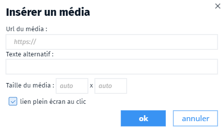

📝 On peut aussi intégrer un tweet avec l'url du tweet. Dans ce cas, le paramètre optionnel indique si on veut afficher les images du tweet et sa largeur.

🖼️ Il est également possible d'intégrer un [comparateur d'images](#md/Comment ajouter un comparateur d'image). Dans ce cas, deux images seront affichées l'une sur l'autre, avec une réglette pour les comparer.

💡 Pour plus d'informations, consultez l'aide en ligne disponible dans l'outil : <i class="fi-info"></i>.

1. [Montre-moi la barre de Markdown de Ma carte](md/la barre de Markdown de Ma carte)
1. [Qu'est-ce que le Makdown ?](md/markdown)


## md/la barre de Markdown de Ma carte
- Markdown
- MD
- édition
- barre

La barre d'outil de Ma carte vous permet d'ajouter plus facilement les balises Markdown dans vos créations.
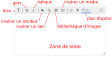

En cliquant sur `plus d'options` un dialogue s'ouvre qui offre plus d'options et un espace pour visualiser le rendu du Markdown.
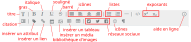

N'hésitez pas à consulter l'aide en ligne <i class="fi-info"></i>.

1. [Qu'est-ce que le Markdown ?](md/markdown)
1. [Comment afficher des attributs en Markdown ?](md/Afficher des attributs en Markdown)
1. [Intégrer des médias en Markdown](md/Intégrer des médias dans Ma carte)


## md/markdown
- Markdown
- définition
- MD
- langage

Le Markdown est un format de balisage très léger qui permet d'écrire rapidement du texte formaté.

Par exemple on écrit &#042;&#042;texte en gras&#042;&#042; pour écrire du **texte en gras**, ou alors &#042;texte en italique&#042; pour écrire du *texte en italique*.

Pour découvrir le Markdown, vous pouvez suivre ce [tutoriel](https://www.markdowntutorial.com/fr/) (même si le MD utilisé par Ma carte diffère légèrement du MD standard et a été étendu pour gérer d'autres type d'affichage).

📝 Ma carte utilise une syntaxe étendue pour afficher des attributs, des médias ou des [widgets](#md/En savoir plus sur les widget Markdown) (diagrammes, calendriers, images).

1. [Intégrer des médias dans Ma carte](md/Intégrer des médias dans Ma carte)
1. [Afficher des attributs en Markdown](md/Afficher des attributs en Markdown)
1. [Afficher une diagramme dans Ma carte](md/Afficher une diagramme dans Ma carte)
1. [En savoir plus sur les widget Markdown](md/En savoir plus sur les widget Markdown)

## md/video attribut conditionnel
- affichage conditionnel
- attribut
- conditionnel
- vidéo

<iframe width="560" height="315" src="https://www.youtube.com/embed/mdCuSZpXLOI?si=tyWqtfvnWIboxbPu" title="YouTube video player" frameborder="0" allow="accelerometer; autoplay; clipboard-write; encrypted-media; gyroscope; picture-in-picture; web-share" referrerpolicy="strict-origin-when-cross-origin" allowfullscreen></iframe>

1. [Comment utiliser les attributs conditionnels ?](md/Comment ne pas afficher un attribut vide)
1. [Qu'est-ce que le Makdown ?](md/markdown)


## selection/Comment sélectionner des objets
- sélection
- objet
- sélectionner
- filtrer
- recherche sur attribut

Il existe plusieurs façon pour sélectionner des objets sur Ma carte.
Tout d'abord, avec l'outil de sélection <i class="fg-arrow-o"></i>, au clic sur un objet d'une couche vecteur, lorsque la couche n'est pas verrouillée (<i class="fi-unlock"></i> dans le gestionnaire de calque).
En appuyant sur la touche <kbd>shift</kbd> + clic vous pouvez sélectionner plusieurs objets.
Vous pouvez également utiliser l'outil de sélection par emprise <i class="fg-extent"></i> pour sélectionner dans un rectangle sur le calque courant.


Vous pouvez également utiliser l'outil de recherche dans l'onglet `Sélectionner` <i class="fg-search-attribtues colored"></i> qui permet de faire une recherche sur les attributs des objets avec des [critères de sélection](#selection/opérateurs).
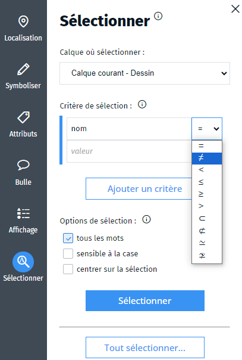

Une fois les objets sélectionnés, vous pouvez les supprimer (<i class="fi-trash"></i> dans la barre de dessin), leurs [appliquer un style](#symboliser/Comment symboliser un objet), leurs [ajouter des attributs](#mceditor/Comment ajouter des attributs à un objet) ou [personnaliser leur info-bulle](#mceditor/Comment paramétrer l'info-bulle d'un objet).

1. [Quels sont les opérateurs de sélection ?](selection/opérateurs)
1. [Qu'est-ce qu'une couche vecteur ?](mceditor/Qu'est-ce qu'une couche vecteur)
1. [Comment saisir des objets ?](mceditor/Comment saisir des objets dans Ma carte)
1. [Modifier les attributs d'un objet](mceditor/Comment ajouter des attributs à un objet)

## selection/opérateurs
- opérateur
- sélection
- filtrage

Les opérateurs de sélection et de filtrage par attribut sont : 
- des opérateurs d'égalité (= égale à, ≠ différent de)
- de comparaison, inférieur / supérieur (<, ≤, ≥ ou >)
- d'inclusion (⊂ contient, ⊄ ne contient pas)
- ou une [expression régulière](https://fr.wikipedia.org/wiki/Expression_r%C3%A9guli%C3%A8re) (≃ vérifie, ≄ ne vérifie pas)

⚠️ Attention, les opérateurs de comparaison dépendent du type de l'attribut qu'ils comparent (numérique ou alphanumérique).
Ainsi : `2 < 10` mais `'2' > '10'`

1. [Comment sélectionner des objets ?](selection/Comment sélectionner des objets)
1. [Utiliser une représentation paramétrique](symboliser/Qu'est-ce qu'une représentation paramétrique)
1. [Les attributs d'un objet](mceditor/Comment ajouter des attributs à un objet)

## symboliser/Comment créer une bibliothèque de symboles
- bibliothèque
- symbole
- symboles

Une bibliothèque de symbole est un moyen pratique de recenser les symboles présents dans la carte pour les réutiliser pour symboliser un objet, pour les ajouter dans la légende ou pour créer une représentation paramétrique.
La bibliothèque de symbole est disponible dans l'onglet `Symboliser` <i class="fi-pencil colored"></i>.
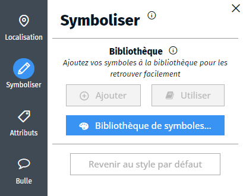

Vous pouvez ajouter de nouveaux symboles à la bibliothèque :
- si un objet est sélectionné, vous pouvez ajouter sa représentation à la bibliothèque en cliquant sur le bouton <button><i class="fi-add"></i> Ajouter</button> dans l'onglet `Symboliser`.
- dans le dialogue de la bibliothèque, vous pouvez créer un nouveau symbole ou dupliquer un symbole existant dans la liste
- vous pouvez également copier un symbole de la légende dans la bibliothèque en passant par le dialogue de la légende, en sélectionnant la ligne de la légende et en cliquant sur la flèche bleue.

Vous pouvez également utiliser la bibliothèque de symbole d'une carte existante.

Vous pouvez appliquer un symbole de la bibliothèque à l'objet sélectionné via le bouton <button><i class="fa fa-book"></i> Utiliser</button> dans l'onglet `Symboliser`.

1. [Comment utiliser la bibliothèque de symbole d'une carte existante ?](symboliser/comment partager une bibliothèque de symboles)
1. [Qu'est-ce qu'une représentation paramétrique ?](symboliser/Qu'est-ce qu'une représentation paramétrique)
1. [Comment ajouter une légende à ma carte ?](mceditor/Comment créer une légende)


## symboliser/Comment mettre en forme une étiquette sur la carte
- etiquette
- étiquette
- étiquettes
- mettre en forme
- dessiner
- toponyme

Une étiquette est un texte placé sur la carte pour caractériser un lieu ou un objet. Ce peut être une annotation ou un toponyme.

Lorsqu'un ou plusieurs objets sont sélectionnés vous pouvez leur ajouter une étiquette dans l'onglet Étiquette de l'onglet `Symboliser` <i class="fi-pencil colored"></i>.
Vous pouvez choisir la police, la taille, l'emplacement, la couleur de l'étiquette et mettre un fond afin de rendre les écritures plus lisibles sur les fonds de cartes.
Cette étiquette peut être la valeur d'un attribut sous la forme `%nom_de_l_attribut%`. Vous pouvez afficher plusieurs attributs `%attribut_1% - %attribut_2%` mais si un des attributs est vide, l'étiquette ne s'affichera pas.

Sur un point, l'étiquette peut s'afficher sur plusieurs lignes, il est possible de l'encadrer et de lui donner une couleur de fond.


Sur une surface, l'étiquette va s'afficher au milieu de la surface.
Sur une ligne, vous pouvez choisir d'afficher l'étiquette le long de la ligne.


Il peut être gênant que les étiquettes se chevauchent sur la carte, la rendant illisible.
Pour cela, vous pouvez dans le style de l'objet interdire les dépassements, dans ce cas, l'étiquette ne pourra pas dépasser de l'objet (ligne ou surface).

Vous pouvez également **nettoyer les chevauchements** dans le style du calque (via le menu <i class="fg-color"></i>  du gestionnaire de couche).


1. [Comment éviter que les étiquettes se chevauchent ?](symboliser/Comment éviter que les étiquettes se chevauchent)
1. [Comment symboliser un objet ?](symboliser/Comment symboliser un objet)


## symboliser/comment partager une bibliothèque de symboles
- partager
- utiliser
- bibliothèque
- symbole
- symboles
- existante

Vous pouvez charger la bibliothèque de symbole d'une carte existante pour la réutiliser dans votre carte.
Pour cela, rendez-vous dans le gestionnaire de couches et cliquez sur le bouton d'ajout <i class="fg-layer-alt-add-o"></i> dans la barre inférieure, puis cliquez sur `Depuis une autre carte...`. Sélectionnez ensuite la carte dans la liste proposée.
Dans le dialogue qui s'ouvre cocher `importer la bibliothèque de symboles` :
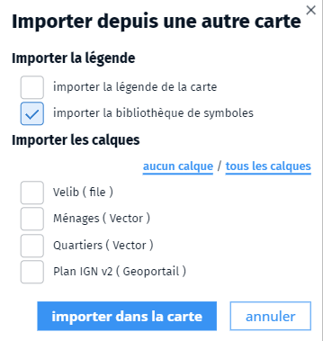

Vous pouvez également enregistrer une carte modèle sur votre ordinateur contenant la bibliothèque de symbole via le bouton <i class="fi-download"></i> de la barre de menus de l'éditeur de cartes. 
Le fichier `.carte` ainsi généré pourra être récupérée simplement par glissé/déposé sur la carte en cours de saisie. Ce fichier pourra aussi être partagé avec d'autres utilisateurs en l'envoyant par mail, par exemple.

1. [Comment créer une bibliothèque de symboles ?](symboliser/Comment créer une bibliothèque de symboles)
1. [Où est le gestionnaire de couche](mceditor/Parle-moi du gestionnaire de couche)
1. [Qu'est-ce qu'une représentation paramétrique ?](symboliser/Qu'est-ce qu'une représentation paramétrique)


## symboliser/Comment symboliser un objet
- symboliser
- symbole
- objet
- couleur
- couleurs

Vous pouvez symboliser l'objet sélectionné dans une couche de dessin via l'onglet `Symboliser` <i class="fi-pencil colored"></i>.

Vous pouvez choisir la couleur, la taille, la forme, le remplissage des objets à afficher.
La symbolisation dépend du type de l'objet (ponctuel, linéaire, surfacique).


Pour les objets ponctuels, Ma carte propose une liste symboles personnalisable, vous pouvez choisir la couleur et les inclure dans une forme (rond, carré, blason, etc.) afin d'harmoniser l'affichage sur la carte.


Vous avez la possibilité d'utiliser une image, sur le net ou dans votre galerie d'images. Le point peut aussi être une annotation, dans ce cas, seule l'étiquette associée va s'afficher.
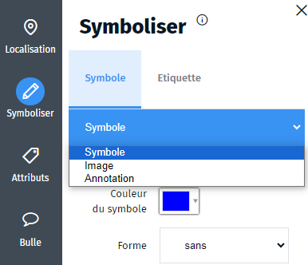

Pour chaque objet, vous pouvez ajouter une étiquette, constituée d'un texte qui s'affiche sur la carte pour caractériser l'objet.
La mise en forme de l'étiquette sur la carte va dépendre du type d'objet auquel elle se rapporte.

1. [Comment ajouter des images à ma galerie ?](macarte/Ma carte peut-il héberger des images)
1. [Comment mettre en forme une étiquette sur la carte ?](symboliser/Comment mettre en forme une étiquette sur la carte)
1. [Bien utiliser la bibliothèque de symboles](symboliser/Comment créer une bibliothèque de symboles)

## symboliser/Comment éviter que les étiquettes se chevauchent
- étiquettes
- chevauchement
- recouvrement
- textes

Il peut être gênant que les étiquettes se chevauchent sur la carte, la rendant illisible.

Pour cela, vous pouvez tout d'abord dans le style de l'objet interdire les dépassements, dans ce cas, l'étiquette ne pourra pas dépasser de l'objet (ligne ou surface).

Vous pouvez également **nettoyer les chevauchements** dans le style du calque (via le menu <i class="fg-color"></i>  du gestionnaire de couche).


Dans ce cas, si une étiquette en chevauche une autre, elle ne sera pas affichée, améliorant la lisibilité. Il suffit généralement de zoomer pour que celle-ci réapparaisse.
C'est la première étiquette qui s'affiche qui va conditionner l'affichage, si vous avez des étiquettes que vous voulez prioritaires, il est conseillé d'afficher cet objet en premier, pour cela, vous pouvez jouer sur l'empilement dans le style des objets.

📝 le nettoyage de l'empilement joue sur tous les calques dont l'option est activée. Dans ce cas, c'est le calque le plus haut placé dans le gestionnaire de calque qui est prioritaire.

1. [Comment mettre en forme une étiquette sur la carte ?](symboliser/Comment mettre en forme une étiquette sur la carte)
1. [Comment symboliser un objet ?](symboliser/Comment symboliser un objet)


## symboliser/Qu'est-ce qu'une représentation paramétrique
- symboliser
- symbole
- symbolisation
- paramétrique

Un symbolisation paramétrique est une manière de symboliser les objets **en fonction de leurs paramètres**.
Dans ce cas, la symbolisation ne sera plus portée par les objets individuellement mais par une règle de symbolisation sur le calque en fonction des attributs de l'objet (si le type est *gendarmerie*, le point s'affiche en bleu).

Sélectionnez la couche dans le gestionnaire de couches et rendez-vous sur le dialogue de style de la couche (bouton <i class="fg-color"></i>) pour activer le style paramétrique.
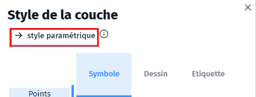

Vous pouvez alors ajouter des symbolisations à la couche en fonction des attributs.

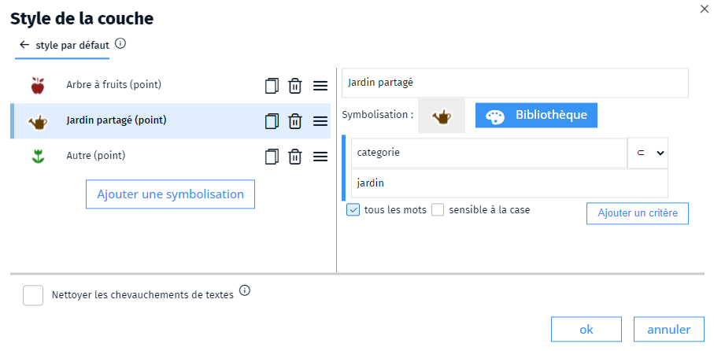

Vous devez au préalable avoir [créé une bibliothèque de symboles](#symboliser/Comment créer une bibliothèque de symboles) correspondant à ce que vous désirez représenter.

Ensuite :
1. Cliquez sur `Ajoutez une symbolisation` 
2. Dans la partie droite, choisissez un symbole dans la bibliothèque (précédemment créée) et donnez un nom à la condition
3. Ajouter une règle de la forme `attribut` ➜ `opérateur` ➜ `valeur`

On peut ajouter plusieurs critères qui vont se cumuler si `tous les mots` est coché 


2. [Comment créer une bibliothèque de symboles ?](symboliser/Comment créer une bibliothèque de symboles)
1. [Quels sont les opérateurs de sélection ?](selection/opérateurs)
1. [Comment symboliser un objet ?](symboliser/Comment symboliser un objet)
1. [Modifier les attributs d'un objet](mceditor/Comment ajouter des attributs à un objet)

